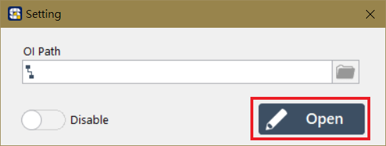

# OI - 設計操作員介面

#### SmaSEQ 的 OI 設計功能，讓使用者可以幫每個 Sequencer （流程編輯器）建立專屬的操作員介面。

點選 Sequencer 畫面上方的 Setting 按鈕，開啟 OI 的設定視窗

## 建立新的 OI

#### 在 OI 的設定視窗中，直接點擊 Open 按鈕，即可進入 OI 設計畫面

## 載入既有的OI

#### 若點擊 OI Path 右側的按鈕，可選擇已經存在的 OI 檔 \(.ssoi\)。

## OI 啟用按鈕

* OI 設定視窗左下角的 Enable/Disable 開關，決定 OI 在專案運行時是否啟用。在 Enable 狀態下，執行專案流程會自動跳出 OI 介面；Disable 狀態則否。

