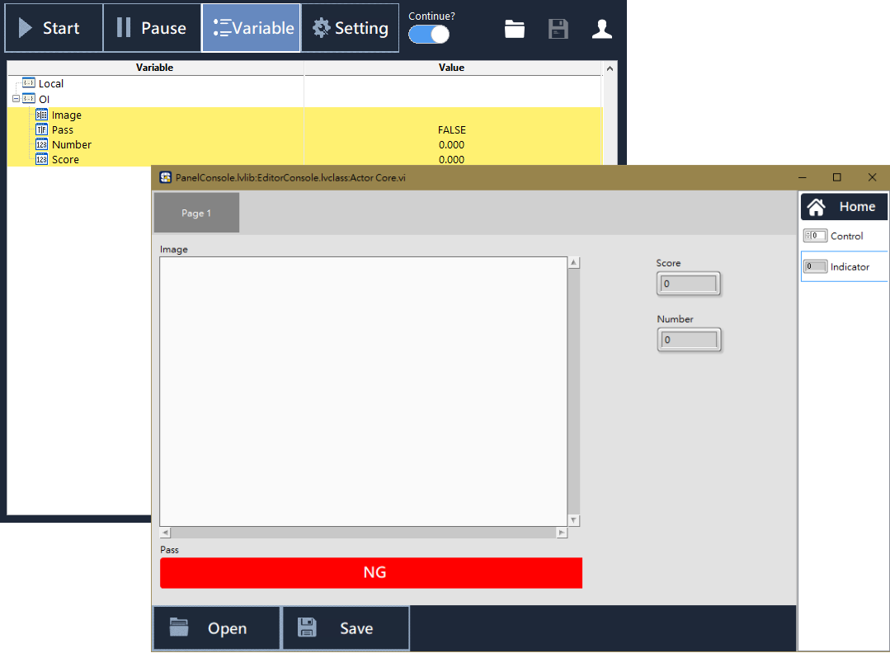

# OI - 操作員介面

## 何謂 OI

#### OI 的全名是 Operator Interface，是提供給操作員使用的介面。SmaSEQ 的 OI 設計功能，讓專案開發人員可以針對操作員的需求，為每個 Sequencer（流程編輯器）建立專屬的操作員介面。

#### 建立與編輯 OI 介面的操作方式，將在本章節後續詳細介紹。

## OI 元件

#### 每個 OI 元件都是一個儲存資料用的變數；不同型態的變數可用來儲存不同資料的類型。

* **Boolean 布林**
  * LED（亮暗燈號）
  * Pass（Pass / Fail 綠紅燈號）
  * Button（一般按鈕）
  * SquareBtn（方形按鈕）
* **Image 影像**
  * Image（影像儲存空間）
* **Numeric 數值**
  * Control（數值輸入元件）
  * Indicator（數值輸出元件）
* **String 字串**
  * Control（字串輸入元件）
  * Indicator（字串輸出元件）
  * Log（較大篇幅的字串輸出元件）
* **Array 陣列**
  * Button（按鈕）
  * LED（燈號）
  * Control（數值輸入）
  * Indicator（數值輸出）
  * Table（字串表格）

#### 

#### 在流程編輯器中與 OI 元件進行互動

在 OI 介面上建立的元件會陳列在變數表中，並且歸類在「OI」群組下，使用者可以在流程編輯器中，透過 OI 元件的名稱傳遞資料。

流程編輯器中，有許多步驟函式可與 OI 變數互動，例如【Expression】、【SmaVISION】、【IF】、【ElseIf】，範例語法如下：

* **在【Expression】寫入數值**
  * `OI.Score=850` 可將 Score 數值元件寫入為 850
  * `OI.Pass=True` 可將 Pass 布林元件寫入為 True
* **在【If】作為條件式**
  * `OI.Score>=700` 表示當 Score 元件數值大於等於 700 時，條件成立。
  * `OI.Pass` 表示當 Pass 元件為 True 時，條件成立
* **在 【SmaVISION】的 &lt; Result &gt; 指令中，紀錄影像模組結果**
  * `OI.Image=Source` 可將影像模組的原圖寫入 Image 影像元件
  * `OI.Number=5` 可將 Number 數值變數寫入為 5


更多步驟函式的語法介紹，請詳見《步驟函式的功能與設定》


