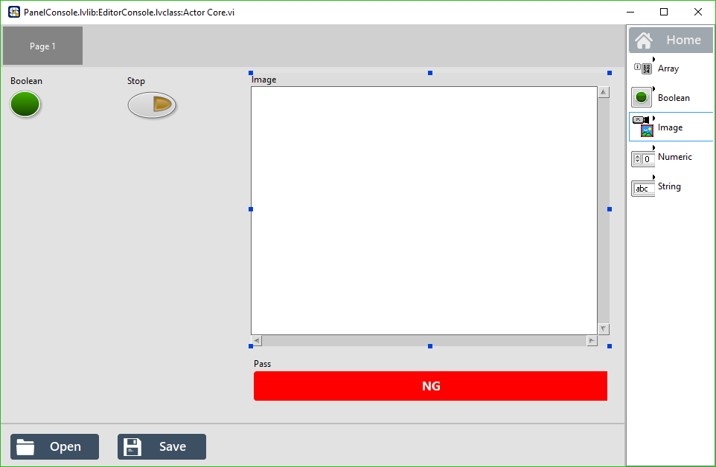
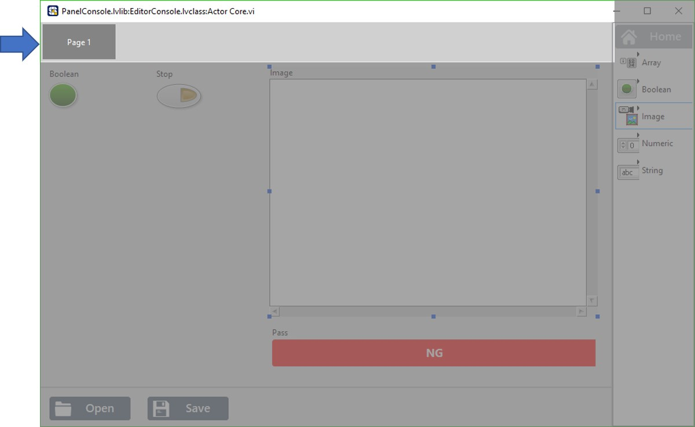

# 介面編輯方法

介面編輯視窗可以分為左半部的OI畫面、右半部的元件選單以及下方的OI操作選單

* OI畫面 : 顯示當下的操作員介面，使用者可以進行編輯與排版的動作。
* 元件選單 : 提供多樣的元件設計獨特的介面。
* OI操作選單 : 能夠進行OI檔案的載入與儲存。

SmaSEQ 2.0支援以下種類的元件 :

* 矩陣型態的元件\(Array\)
  * 按鈕\(Button\)
  * 燈號\(LED\)
  * 輸入參數\(Control\)
  * 輸出參數\(Indicator\)
  * 表格\(Table\)
* 布林型態的元件\(Boolean\)
  * 按鈕\(Button\)
  * 燈號\(LED\)
  * 檢測狀態\(Pass\)
* 影像型態的元件\(Image\)
* 數值型態的元件\(Numeric\)
  * 輸入數值\(Control\)
  * 顯示數值\(Indicator\)
* 文字型態的元件\(String\)
  * 狀態列\(Log\)
  * 輸入文字\(Control\)
  * 顯示文字\(Indicator\)

## \# 新增元件

透過直接在元件選單中對著欲新增的元件雙擊左鍵即可將元件加入到OI畫面當中。

## \# 編輯元件

在OI畫面上對著想要編輯的元件點選右鍵，即可進行重新命名、刪除、設定矩陣的欄寬列高等修改，另外按住Shift可以在畫面中移動元件，按著Ctrl點擊元件則能夠編輯元件的大小。

## \# 新增分頁

在OI畫面的上方能夠為操作員介面新增複數分頁，於分頁欄位點擊右鍵即可進行新增、重新命名與刪除的動作。

