# OI 編輯器操作說明

#### 介面編輯器主要可分為 「OI 排版介面」，與「元件選單」。OI 排版介面即是專案執行時的畫面，使用者可從元件選單中挑選所需的元件，加到 OI 排版介面。

#### SmaSEQ 的 OI 元件根據資料格式有以下分類：

* **Boolean 布林** 

  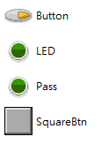

  * LED（亮暗燈號）
  * Pass（Pass / Fail 綠紅燈號）
  * Button（一般按鈕）
  * SquareBtn（方形按鈕）

* **Image 影像** 

  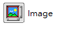

  * Image（影像儲存空間）

* **Numeric 數值**

  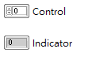

  * Control（數值輸入元件）
  * Indicator（數值輸出元件）

* **String 字串**

  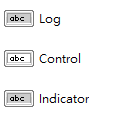

  * Control（字串輸入元件）
  * Indicator（字串輸出元件）
  * Log（較大篇幅的字串輸出元件）

* **Array 陣列**

  \*\*\*\*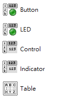

* Button（按鈕）
* LED（燈號）
* Control（數值輸入）
* Indicator（數值輸出）
* Table（字串表格）

## 新增元件

#### 在元件選單中找到需要的元件型態，雙擊滑鼠左鍵即可將元件加到 OI 排版介面中。

## 編輯元件屬性

### 基本屬性

* **名稱**
  * OI 介面上的元件名稱，即是變數表中的 OI 變數名稱。
  * 在元件上點擊滑鼠右鍵，即可選擇 Rename 重新命名元件。

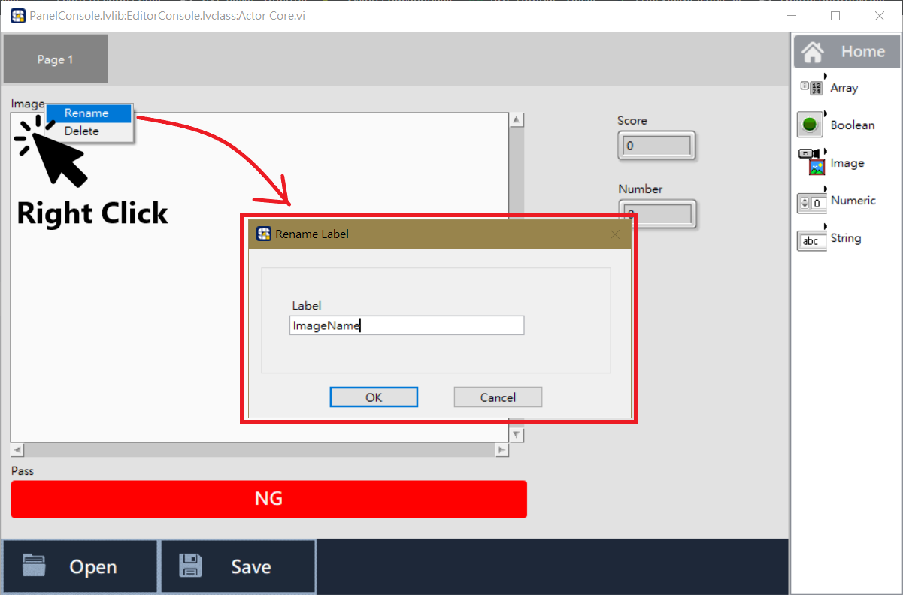

\*\*\*\*

* **位置排版**
  * 元件剛加入排版介面時會在畫面的左上角，此時可按住 Shift 鍵，再以滑鼠左鍵拖曳元件，移動並擺放到適合的位置。

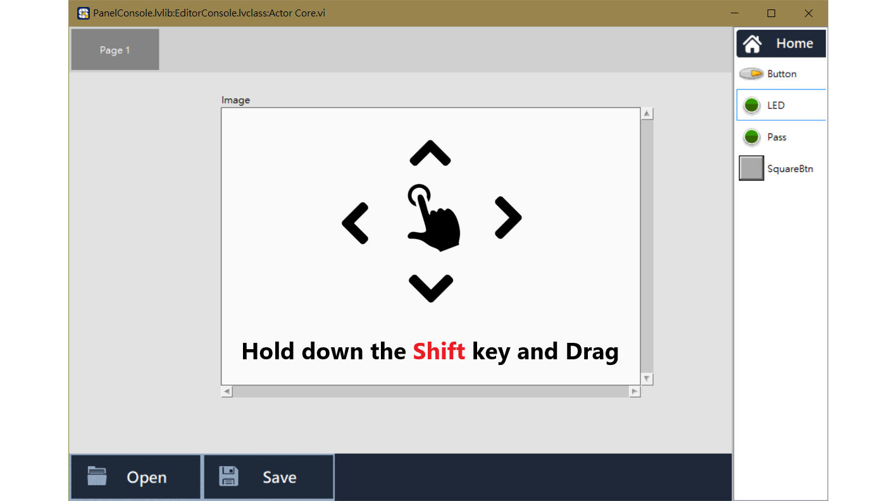

\*\*\*\*

* **元件縮放**
  * 若元件的預設大小不符合需要，可按住 Ctrl 鍵，再以滑鼠左鍵單擊元件，即可開啟元件的縮放功能；此時即可放開 Ctrl 鍵，直接以滑鼠進行縮放動作。

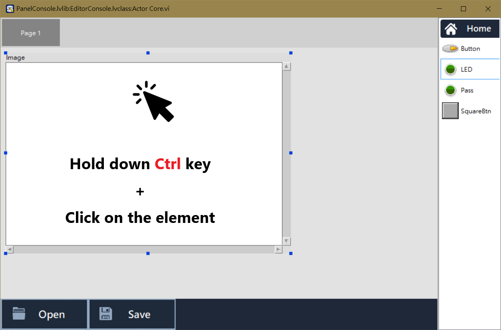

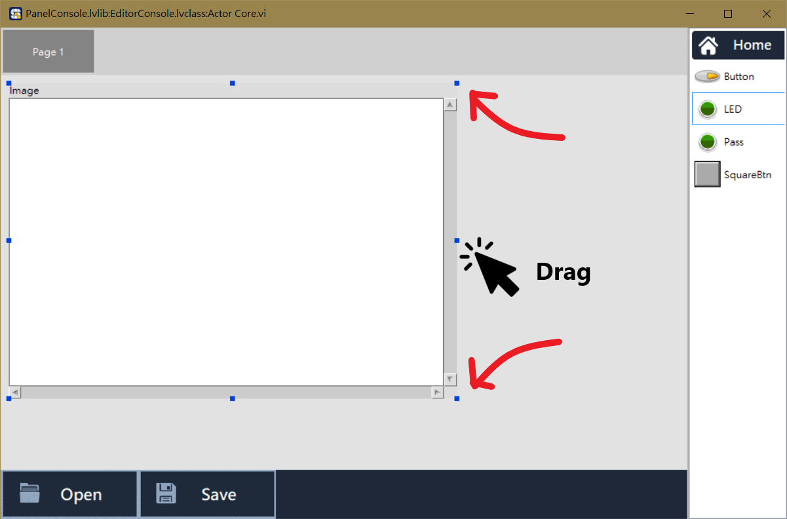

#### 

### 其他屬性

* **燈號顏色**
  * 部分 Boolean 型態的燈號或按鈕，可調整開關顏色。

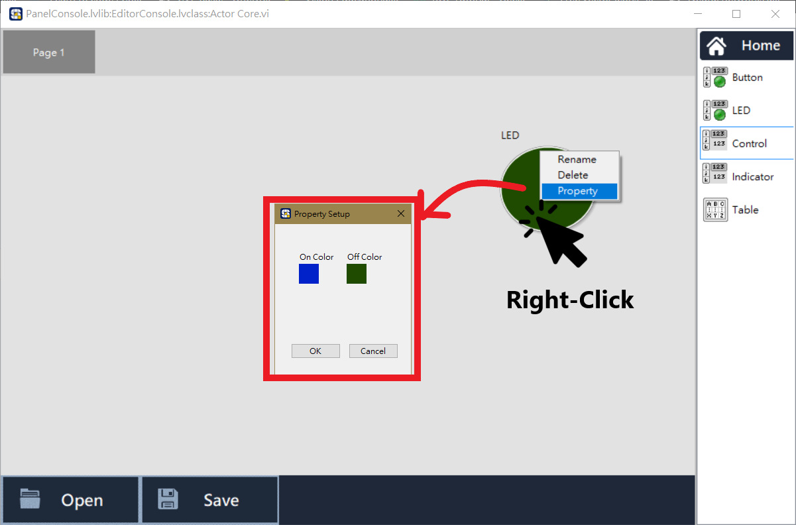

\*\*\*\*

* **陣列大小**
  * Array 陣列型態的元件，可調整陣列的大小。

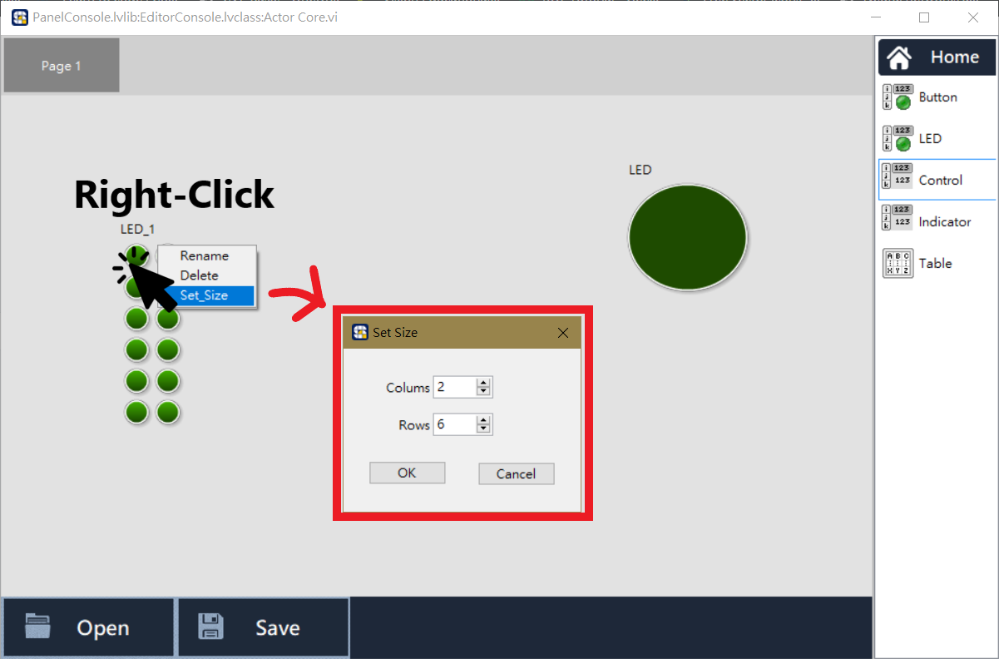

## 增加介面分頁

#### 若當前的版面不夠擺放所有的元件，可在 OI 排版介面的上方，右鍵新增分頁，亦可為該分頁命名。

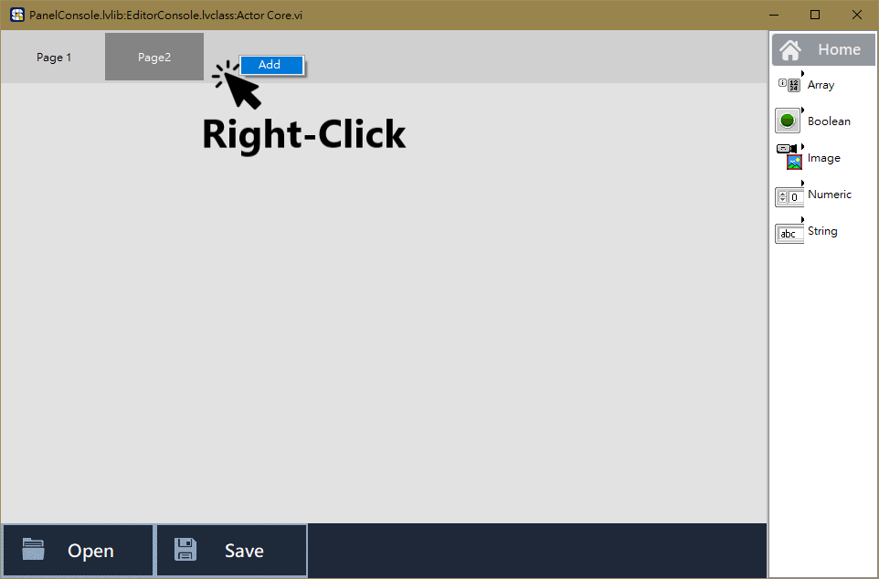

