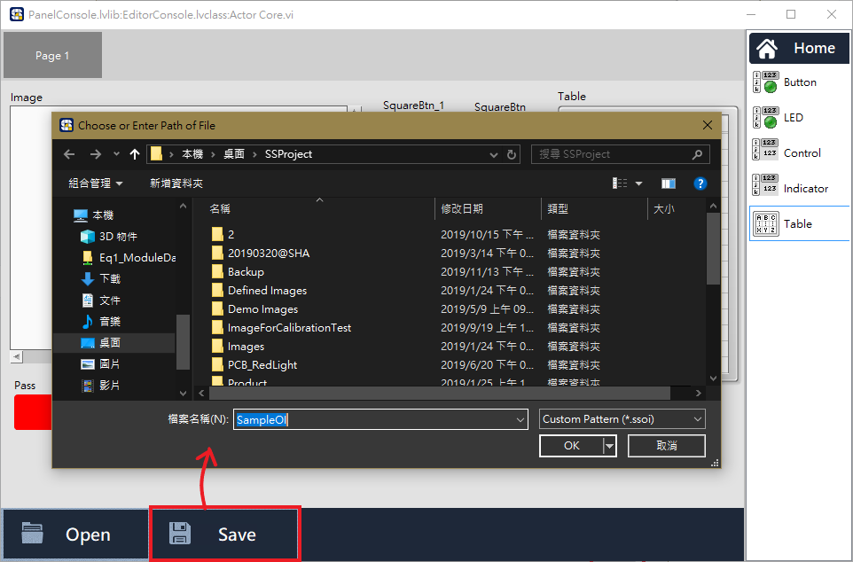
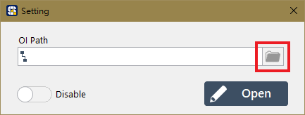
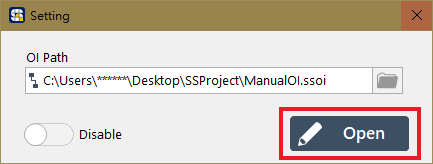
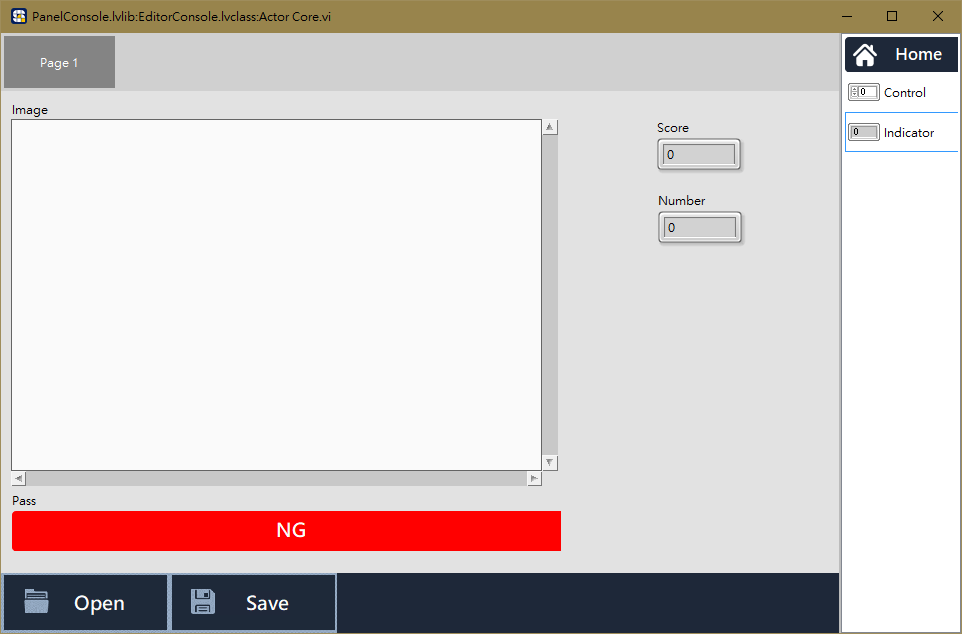
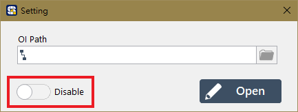

# 新建或載入 OI 檔

#### 首先，點選 Sequencer 畫面上方的 Setting 按鈕，開啟 OI 的設定視窗

## 建立新的 OI

#### 在 OI 的設定視窗中，直接點擊 Open 按鈕，即可進入 OI 編輯器。

#### 完成 OI 的編輯後，點擊下方 Save 按鈕，儲存 OI 。


有關 OI 編輯器的元件說明與操作方式，請參閱《 OI 編輯器操作說明》


## 載入既有的 OI

#### 若點擊 OI Path 右側的按鈕，可選擇已經存在的 OI 檔 \(.ssoi\)。

## OI 啟用開關

* OI 設定視窗左下角的 Enable/Disable 開關，決定 OI 在專案運行時是否啟用。在 Enable 狀態下，執行專案流程會自動跳出 OI 介面；Disable 狀態則否。

