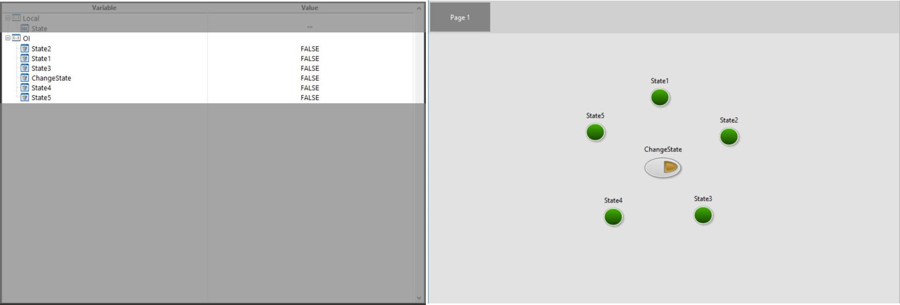

# 在流程編輯模組呼叫介面物件

完成OI畫面的編輯與設計後，回到SmaSEQ 2.0的主畫面開啟Variable的標籤可以看到OI上的元件已經自動新增於OI變數群組當中，若要在流程編輯模組中調用OI變數則可以仿造呼叫Local群組變數的方式，在寫入或讀取元件狀態的步驟中輸入格式\[OI.變數名稱=寫入數值\]或是\[Local.變數名稱=OI.變數名稱\]，如此便可以加入人機互動的功能。

