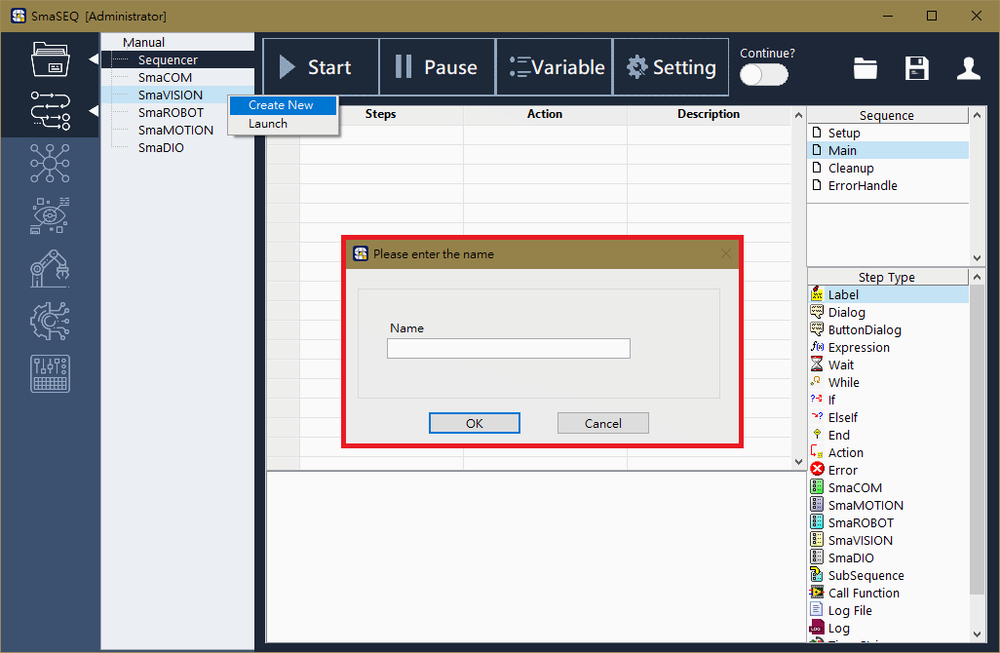
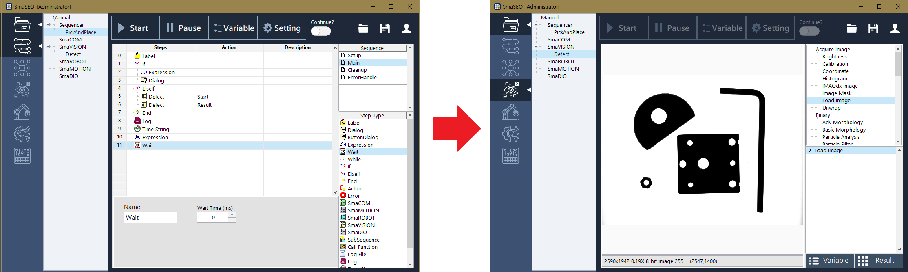
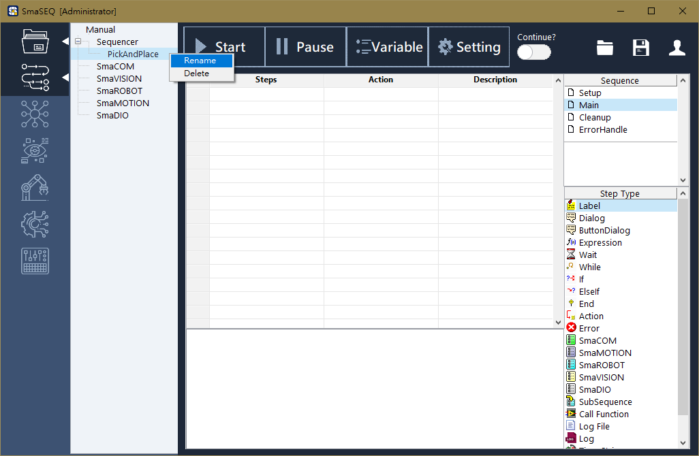

# 基本操作說明

## 模組列表

畫面左側是模組列表，列表上會顯示可用的模組類別如 SmaCOM, SmaVISION 等，以及目前已建立的模組清單，使用者可在這個列表中進行模組的增加、刪除與切換。

## 新建模組

選擇模組列表中的模組，按下滑鼠右鍵即可選擇 Create New 新建模組並為其命名。

## 切換模組

在已建立的模組上，雙擊滑鼠左鍵，即可切換進入該模組。

## 重新命名與刪除模組

對著已存在的專案，按下右鍵可選擇執行重新命名或刪除的動作。

