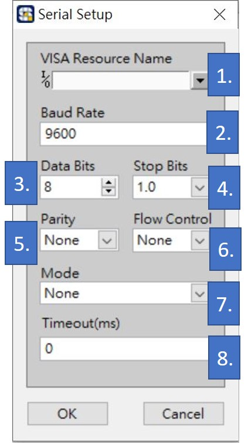

# Serial 與設定參數

* 使用 Serial 連線方式時，點擊「Settings」可調整以下設定：

1. 連接埠編號選擇。
2. Buad Rate設定，預設是9600。
3. 資料傳輸 Bit 數量設定，預設值為8 bits。 
4. 結束資料 Bit 數量設定，預設值為1.0 bits。
5. 設定資料的同位元檢查，選項包含 None、odd、Even、Mark 與 Space。
6. UART 控制流量設定，選項包含 XON/XOFF、RTS/CTS 與 OTR/OSR。
7. 字串換行顯示設定，選項包含 LF\(\n\)、CR\(\r\) 與 CRLF\(\r\n\)。
8. 連線逾時設定。

