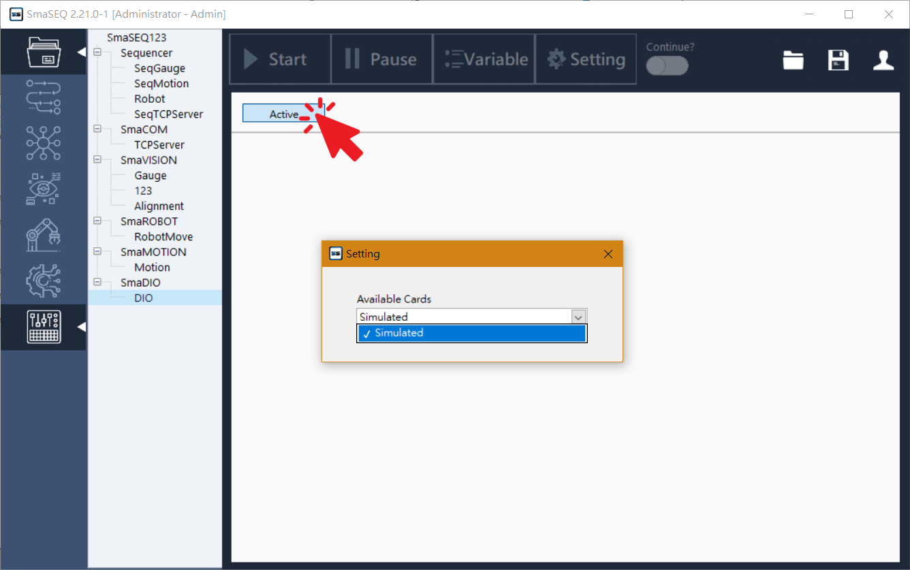
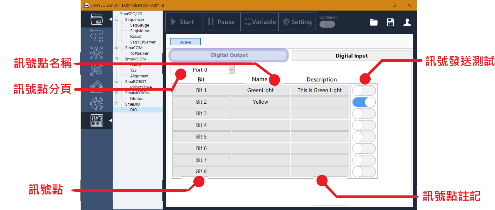
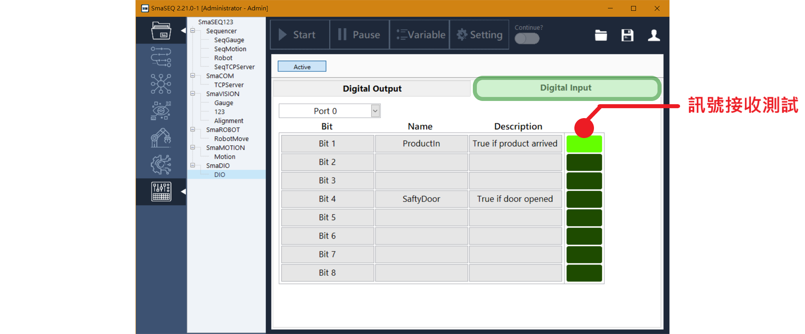

# 基礎設定

## 選擇 I/O 卡

將擴充的 I/O 卡安裝到電腦上後，按下 SmaDIO 介面上的 「Active」 按鈕，選擇要設定的卡片並關閉選擇視窗即可。

## 設定數位訊號

* **訊號點分頁：**可切換不同訊號點分頁。
* **訊號點：**數位訊號接腳。
* **訊號點名稱：**使用者定義訊號點的名稱後，始可在流程中選用並控制。
* **訊號點註記：**為訊號點提供說明，強化可讀性。
* **訊號輸出測試：**可開關切換訊號，測試通訊是否正常、訊號點位是否正確。
* **訊號輸入測試：**顯示數位輸入訊號的狀態，亮燈為 True，暗燈為 False。

