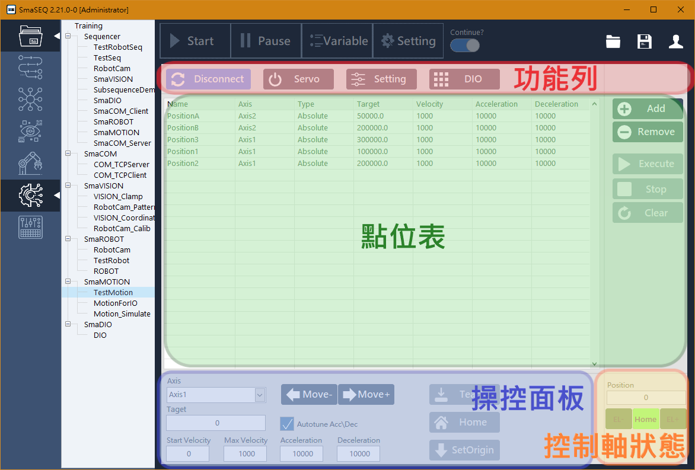

# SmaMOTION 模組

#### 運動控制系統是讓機器能夠根據預定目標，執行高速與高精度運動的核心技術，SmaMOTION 整合了多樣的運動控制卡，讓使用者可直接應用於多軸平台，簡化了開發的過程與成本。

本章節將分成以下幾個主題介紹：

* 連線設定
* 馬達操控
* 點位表
  * 點位增減與運行
  * 點位參數設定
* 軸卡數位 I/O

## 操作介面

SmaMOTION模組介面可以分為4個區域：

* **功能列：**軸卡的連線、運動控制相關參數，與數位 I/O 設定。參數因軸卡而異。
* **點位表：**紀錄點位位置、移動速度等。
* **操控面板：**操控馬達移動。
* **控制軸狀態：**顯示當前操作軸的位置資訊。

