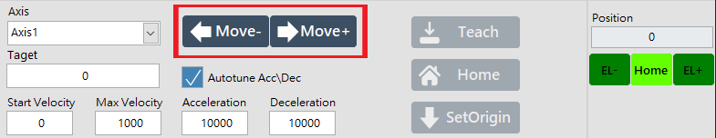
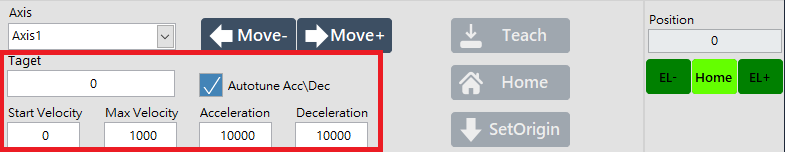
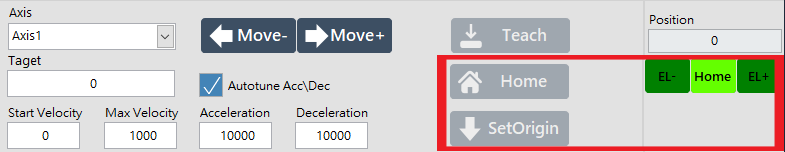
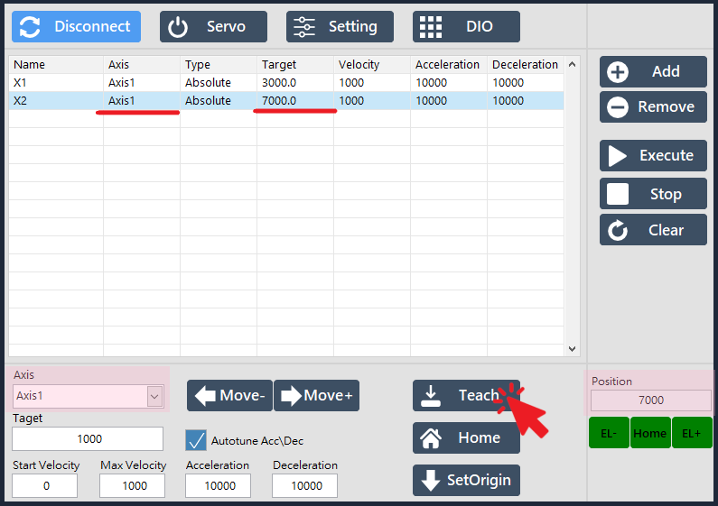

# 馬達操控與教點

## 操控馬達

### 移動軸

#### Axis 選單可選擇當前要控制的軸。

### 移動方向

#### Move 按鈕可控制移動的方向（＋／－）。

### 移動量與速度

#### Target 可指定移動量；Max Velocity 可指定移動速度、Acceleration / Deceleration 可指定加減速度；勾選 Autotune Acc\Dec 會在更改 Max Velocity 的同時調整 Acceleration 與 Deceleration 的值。

### 回原點 / 設定原點

#### Home 按鈕可指定選擇的軸回原點； SetOrigin 按鈕可指定當前位置為 0 點。燈號會顯示該軸的位置狀態（左極限、右極限、Home 點）

## 點位教導

#### 選擇要教導的點位後，按下 Teach 按鈕，即可將當前控制面板上的 Axis 與 Position 寫至該點位中。

