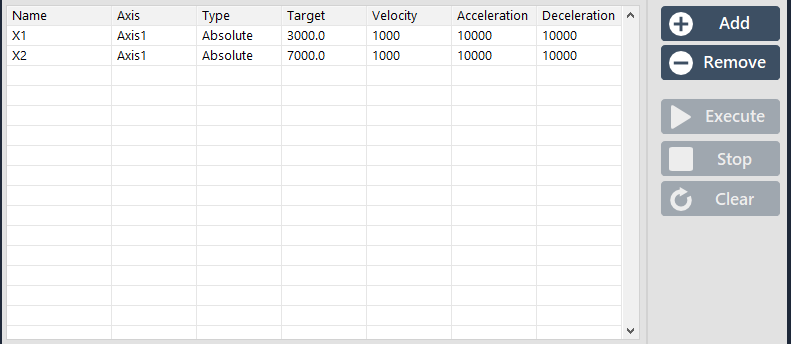
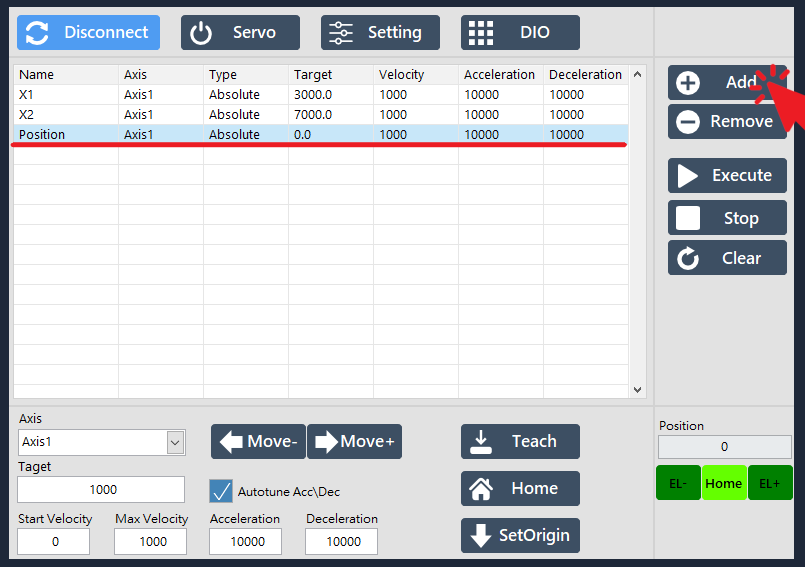
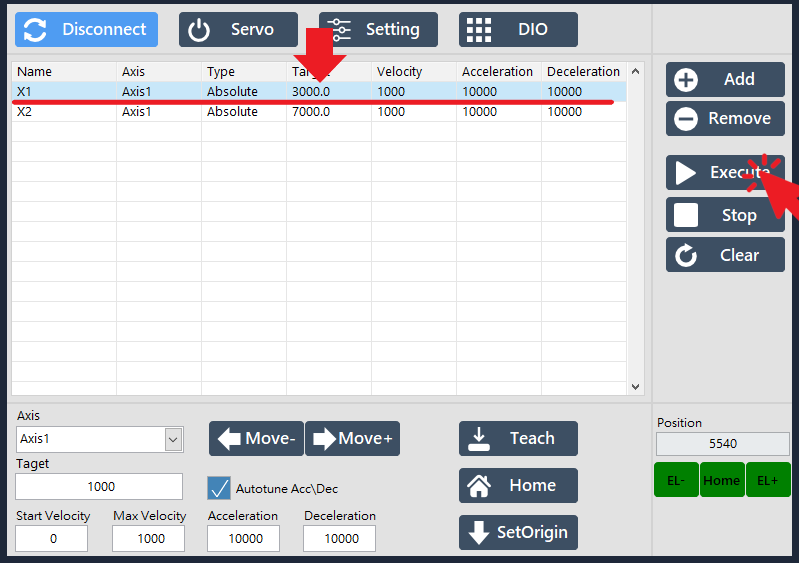

# 座標點位表

#### SmaMOTION 以點位表紀錄各個點的位置、屬於哪個軸。使用者可設定每個點的名稱、目標位置、速度、移動模式等參數。

## 點位增減

#### 點擊 Add 按鈕，可新增一個新點位； Remove 按鈕則可刪除指定的點位。

## 點位操控

#### 選擇要運行的點位後，點擊 Execute 按鈕，即可控制馬達移動至該位置；Stop 按鈕則可停止移動。

