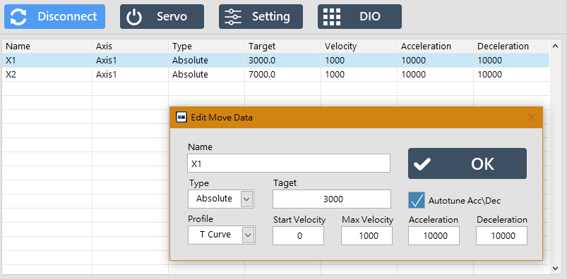
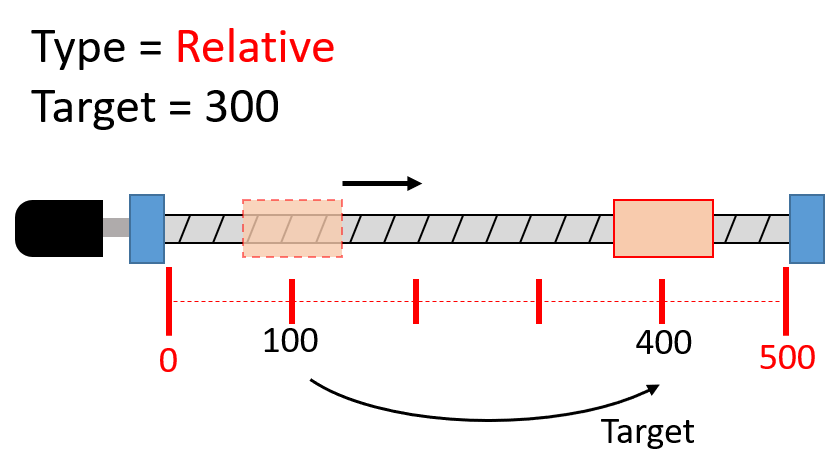
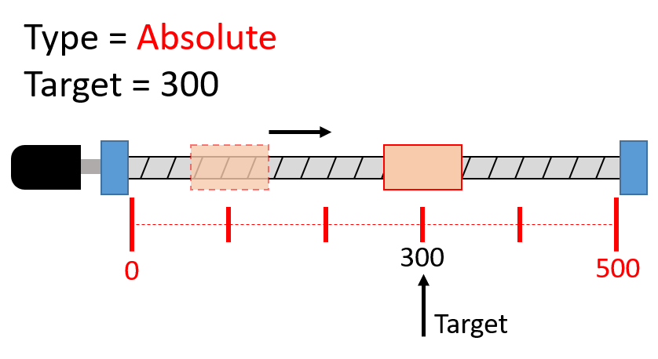

# 點位參數設定

#### 雙擊點位，可察看與編輯該點的參數。

* Name：點位名稱。
* Type：點位的屬性。Absolute 為絕對座標；Relative 為相對移動。
* Target：移動的目標值（單位為 Pulse）。
* Profile：加減速度模式。
* Start Velocity : 移動的起始速度。
* Max Velocity : 移動的最大速度
* Acceleration : 加速度。
* Deceleration : 減速度。

### Type 示意圖

