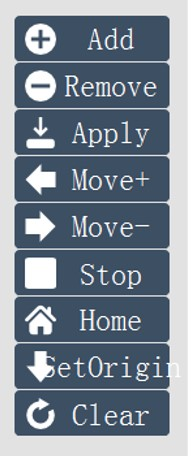

# 點位操作

SmaMOTION模組中點位設定完成後，能夠進行伺服軸的運動測試，在點位表中選擇要移動的點位後，介面右側的操作視窗中具有以下的伺服運動功能 :

* **伺服移動\(Move\)** : 點位的移動
* **伺服停止\(Stop\)** : 移動過程中停止移動
* **回原點\(Home\)** : 單軸回到原點位置
* **設定原點\(SetOrigin\)** : 將單軸當下位置設定為原點
* **錯誤重製\(Clear\)** : 當運動過程中出現錯誤停止時進行錯誤重製

