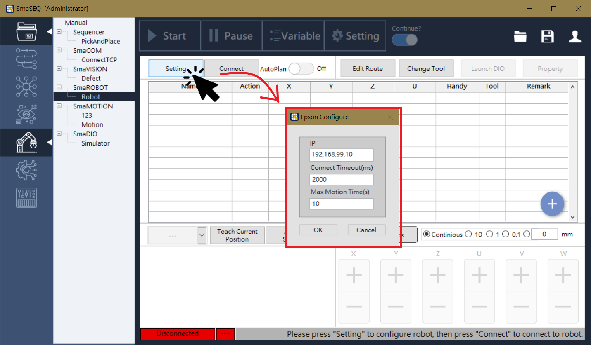
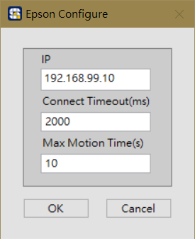
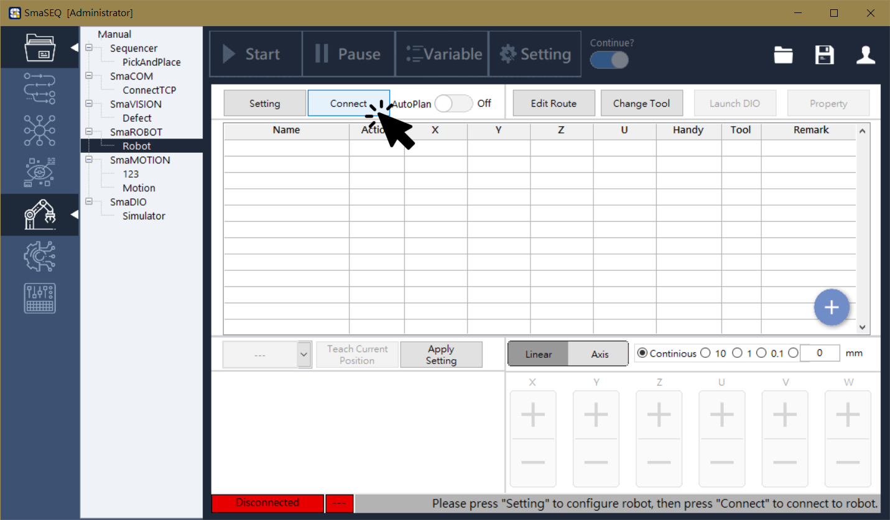
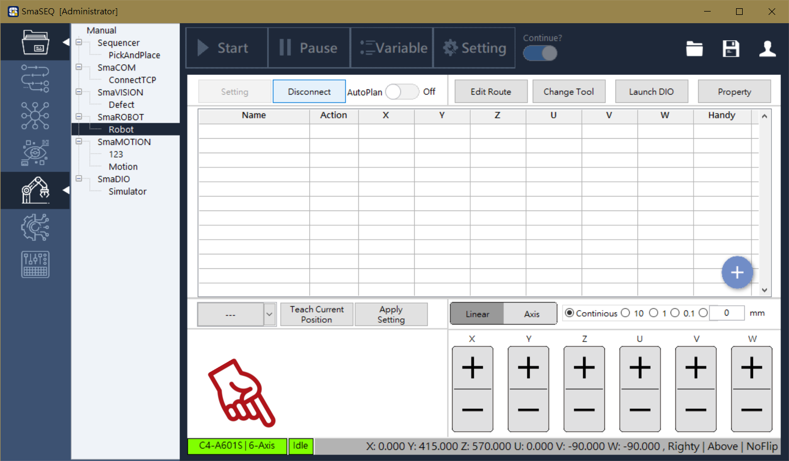

# 連線設定

#### SmaROBOT 使用 TCP/IP 通訊協定與手臂連線，在 Robot Server 啟動後，SmaROBOT 只需設定 IP ，即可與手臂連線，進而操作手臂與設定座標點位。

## 開啟設定視窗

#### 點擊 SmaROBOT 介面左上方的 setting 按鈕，即可開啟連線設定視窗

* **IP**
  * 手臂的 IP 位址，一般預設值為「192.168.0.1」。若無法連線，請參考各廠牌手臂 IP 查詢方式。
* **Connect Timeout（連線逾時時間）**
  * 設定手臂控制器傳送指令的連線逾時時間，預設值為 2000 毫秒。
* **Max Motion Time（最大移動等待時間）**
  * 手臂點對點移動指令的等待時間，預設值為 10 秒。
  * Sequencer 流程運行時，若超過最大移動等待時間會觸發錯誤程序。

## 連線

####  點擊 Connect 按鈕，與手臂連線

#### 連線成功後，界面下方會顯示手臂型號與手臂目前座標位置

