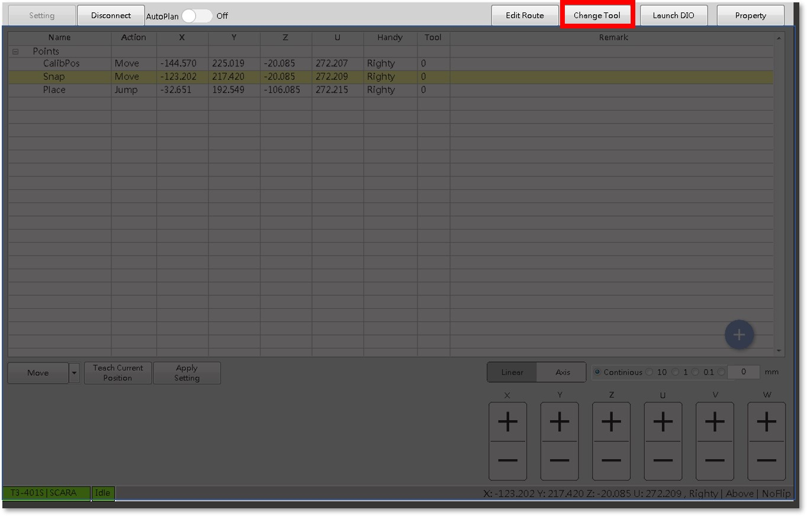
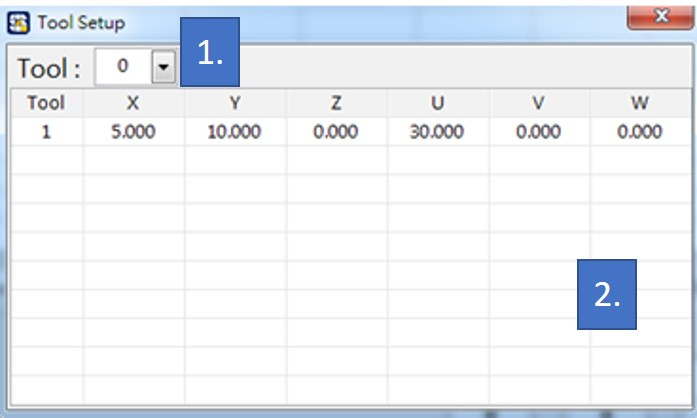

# 工具設定

#### 機械手臂在不同的工作內容下，可能會裝載不同的工具，因應工具的不同，手臂的移動座標中心可能需要調整；而 SmaROBOT 的 Tool 功能即是為此而生，讓使用者新增工具點的座標，作為手臂移動的中心。

* 機械手臂的工具設定，在 SmaROBOT 操作介面的右上角紅框處：

* 點擊後出現以下畫面：

1. **手臂工具編號**：以編號來管理不同的工具座標。
2. **手臂工具點位表**：顯示已存在的工具座標。使用者亦可直接在此修改工具座標。

