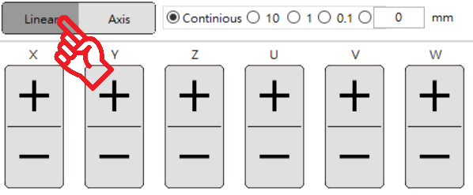
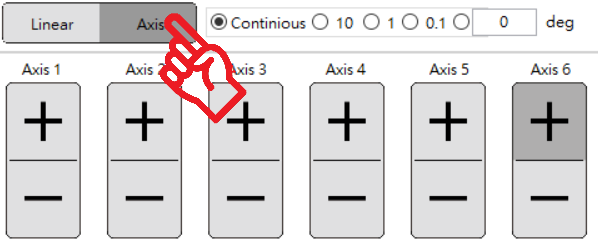
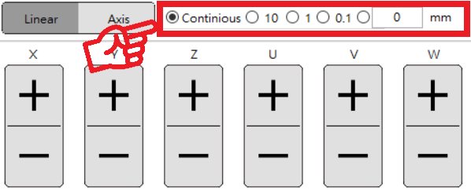

# 手臂操控

#### **連線手臂後，使用者即可使用操作面板來控制手臂。操作**面版位於 SmaRobot 介面的右下方。

## **操控模式**

#### **操控模式分為「Linear」座標系移動，與「Axis」關節移動**

* **Linear 座標系**
  * 四軸：\[ X , Y , Z , U \]
  * 六軸： \[ X , Y , Z , U , V , W \]

* **Axis**

  * 四軸：\[ Axis 1 , Axis 2 , Axis 3 , Axis 4 \]
  * 六軸：\[ Axis 1 , Axis 2 , Axis 3 , Axis 4 , Axis 5 , Axis 6 \]

## 移動距離

#### 移動距離「寸動」與「連續移動」

* 寸動
  * 每按一下操作面板的「+」、「-」按鈕，手臂即移動一固定距離。
* 連續移動
  * 長按操作面板的「+」、「-」按鈕，手臂即連續移動，直到放開按鈕為止

