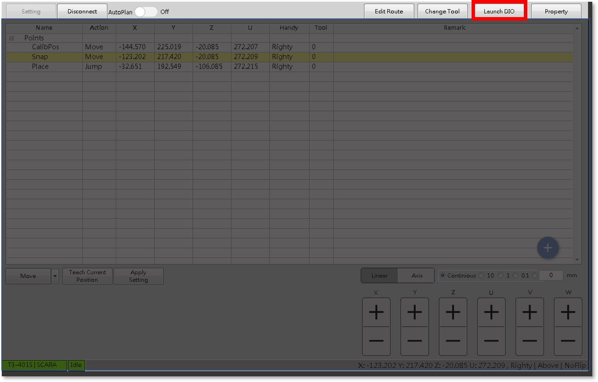
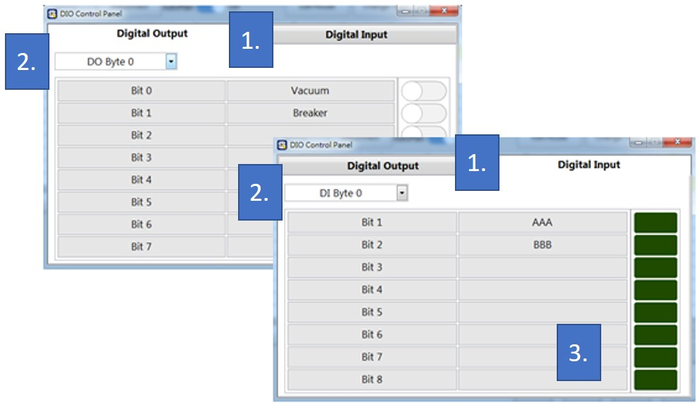

# 手臂控制器DIO

手臂控制器不光只是控制手臂而已，在其他與手臂相關的IO也是一併在控制器中操作，SmaRobot介面整合了手臂控制器支援的DIO進行設定與控制，以下為手臂控制器IO的介紹。

* 手臂控制器IO的位置在SmaRobot介面的右上邊紅色框處：

* 點擊之後出現以下畫面：

1. **DI/DO控制器切換頁面**：依照使用者需求手動切換該頁面。
2. **DI/DO編號延續切換頁面**：依照使用者需要手動新增或切換該頁面。
3. **DI/DO編輯頁面**：使用者可以依需求新增與編輯IO。

