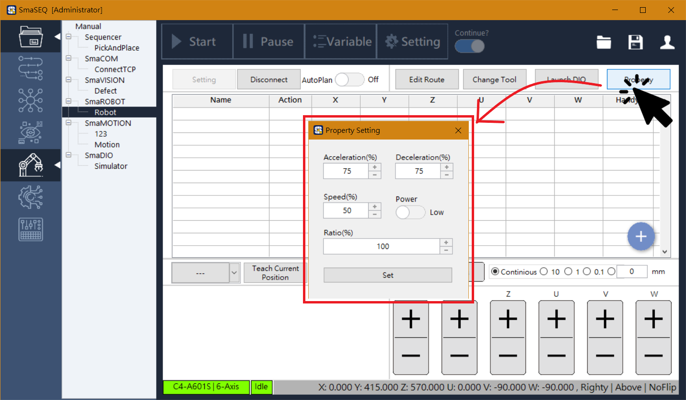
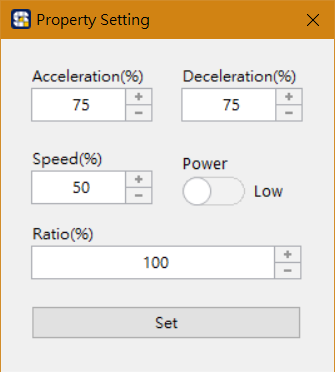

# 手臂速度設定

#### SmaROBOT 可直接設定手臂的基礎移動速度與功率。點擊介面上方的「Property」按鈕，即可開啟速度設定視窗。（連線手臂後方能操作）

* **Acceleration（加速度）**
  * 手臂從停止狀態開始移動時的加速度百分比。
* **Deceleration（減速度）**
  * 手臂從移動狀態即將停止時的減速度百分比。
* **Speed（手臂最大速度）**
  * 手臂移動的最高速度比率，全速運動為100%。
* **Power（功率）**
  * 手臂的輸出功率，與手臂移動速度有關，可分為低功率、高功率。
  * 調機時，建議使用低功率 40%以下，或高功率 5%以下　
* **Set（參數寫入按鈕）**
  * 當以上參數調整完畢後按下 Set 按鈕，新的參數值即會寫入手臂。

