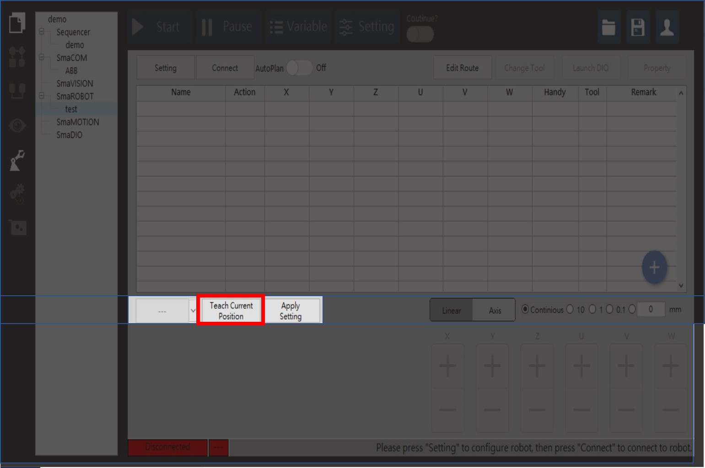
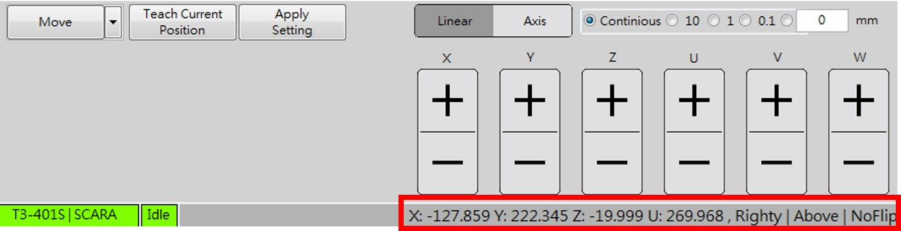

# 教導當下點位

當手臂移動到使用者所期望的點位，那勢必要存取或是取代當下的位置，SmaRobot不只是存取點位的功能，對於手臂的姿態也一併存入或是取代點位表裡，以便後續使用者的操作，以下是教導點位的介紹。

* 教導點位的位置在SmaRobot操作介面左下角紅色框處：

1. 當手臂點位或姿態有更動，可以不必另外新增點位，只需要在前次的點位設定欄位點擊"Teach Current Position"即完成設定。
2. 可以對照右下角的當前座標值驗證是否存取成功。

