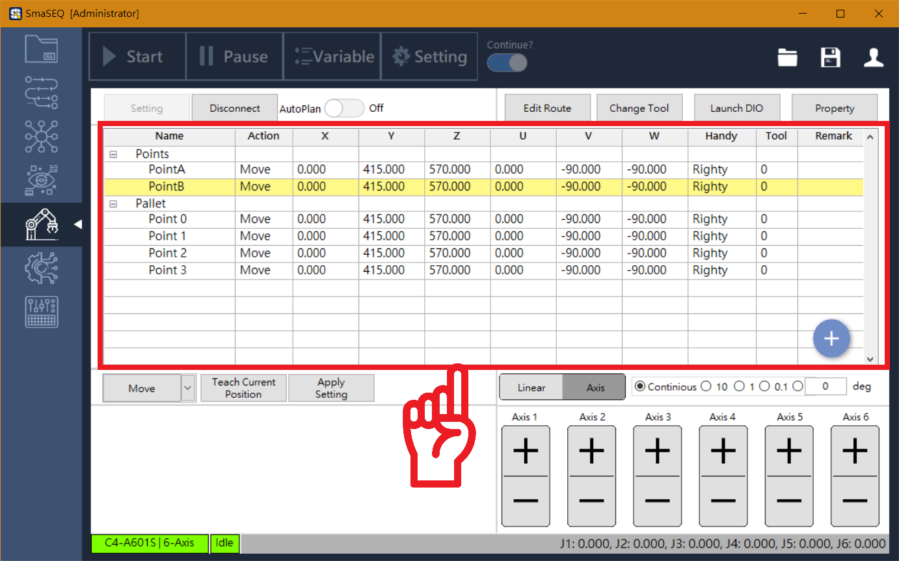

# 座標點位表

#### 在一個手臂的應用中，常會需要記錄各個工作位置，座標點位表以表格化的方式，陳列各個使用者自定義的座標點，讓使用者可以直接指定目標點位，命令手臂移動。

#### 點位表會紀錄座標點位的各項資訊，讓使用者一目了然，亦可在點位表上直接編輯數值。

* **Name（座標點的名稱）**
  * 未來 Sequencer 會以此名稱，對 SmaROBOT 下移動指令。
* **Action（點的移動方式）**
  * Move：手臂自然移動
  * Move Line：手臂在兩點間以直線移動
  * Jump：以跳躍方式移動，跳躍高度可選擇 Absolute（絕對高度） 或 Relative（相對高度）
* **\[ X , Y , Z , U , V , W \]（點座標位置）**
  * 以 Linear 數值記錄。
* **Handy（手臂姿態）**
  * 手臂移動的姿態，分成左手姿態與右手姿態。
* **Tool （手臂工具）**
  * 在手臂有工具的情況下，可設定工具位置，讓手臂以工具中心為移動基準點。
* **Remark（點位註記）**
  * 使用者可為點位添加註記，提升座標點位表可讀性。


關於座標點位的建立與設定方式，將再下個小節《設定座標點位》中說明。


## 

