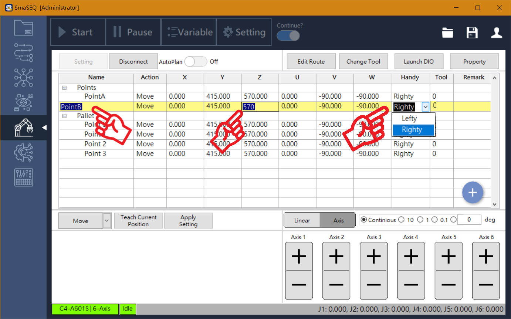
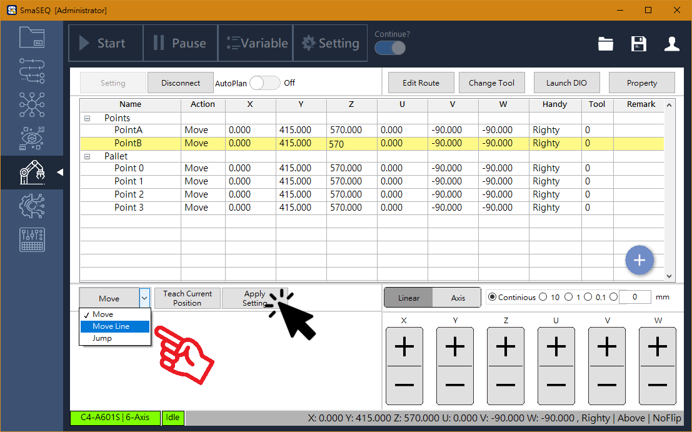

# 設定座標點位

#### SmaROBOT 可針對每一個座標點位，給予專屬的點位設定。

## 新增點位

#### 座標點位表的右下方，有一「+」號圖示，滑鼠指向此圖示後，可選擇新增「單一點位」或「棋盤點位」，此時，新增的點位會以手臂當前的位置為座標值。

## 修改點位資料

#### 點位表會紀錄座標點位的各項資訊，讓使用者一目了然。使用者亦可在點位表上直接修改各項數值。

* **Name（座標點的名稱）**
  * 未來 Sequencer 會以此名稱，對 SmaROBOT 下移動指令。
* **\[ X , Y , Z , U , V , W \]（點座標位置）**
  * 以 Linear 數值記錄。
* **Handy（手臂姿態）**
  * 手臂移動的姿態，分成左手姿態與右手姿態。
* **Tool （手臂工具）**
  * 在手臂有工具的情況下，可設定工具位置，讓手臂以工具中心為移動基準點。
* **Remark（點位註記）**
  * 使用者可為點位添加註記，提升座標點位表可讀性。

## 座標教導

#### 以操作面板控制手臂到適當的工作位置時，可使用教點按鈕，將手臂當下的座標，寫到指定的已存在點位上。

## 移動方式

#### 每個點位都可以設定特定的移動方式，選擇移動方式後，按下「Apply Setting」即完成修改。

### **Action（點的移動方式）**

* **Move**
  * 手臂自然點到點移動
* **Move Line**
  * 手臂在兩點間以直線移動
* **Jump**
  * 以跳躍方式移動，跳躍高度可選擇 Absolute（絕對高度） 或 Relative（相對高度）
    * Absolute：手臂座標系的絕對高度
    * Relative：根據手臂當下位置為基準的相對高度

