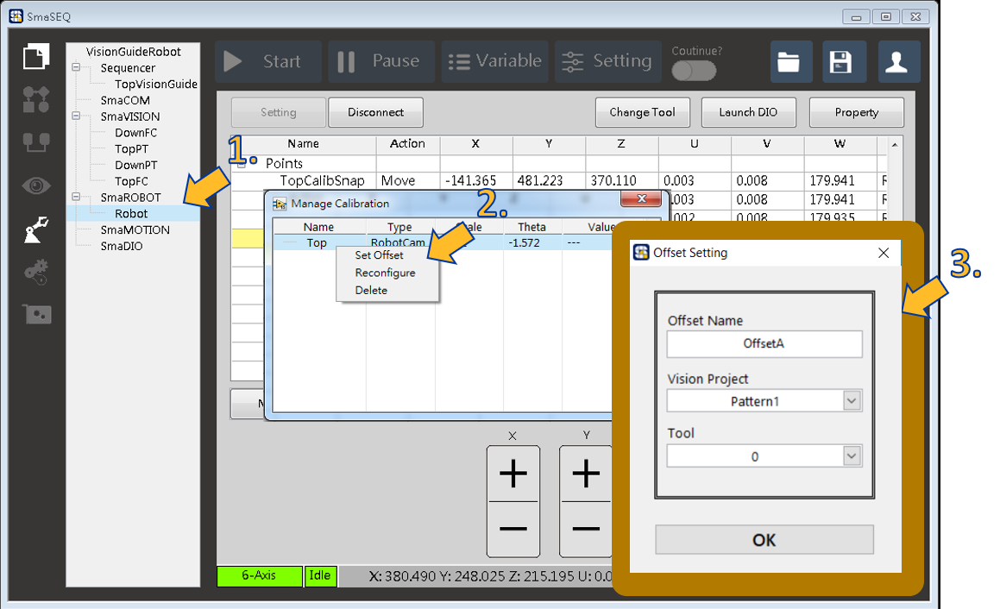
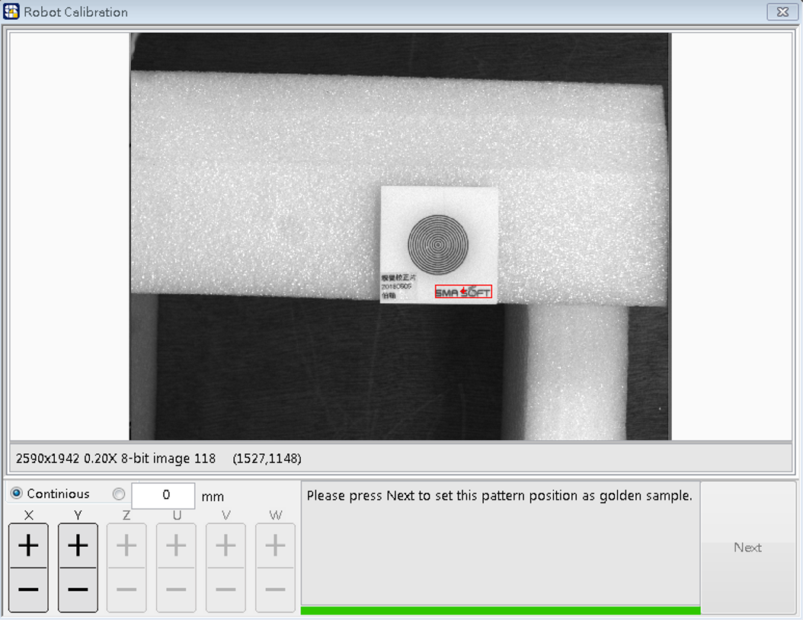
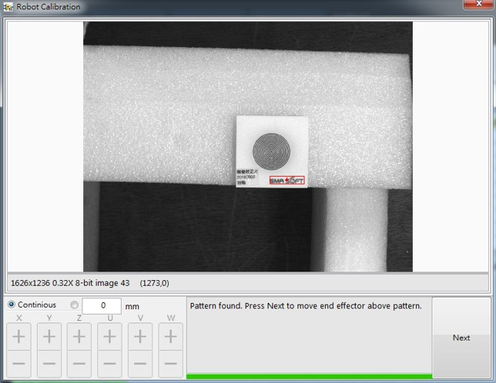
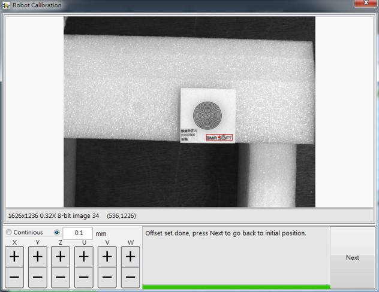
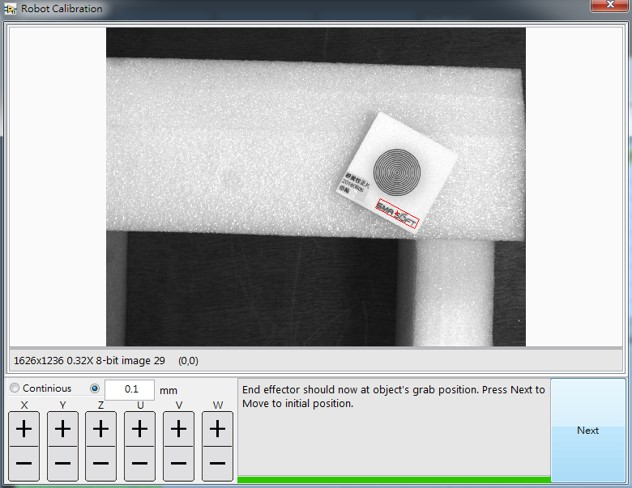
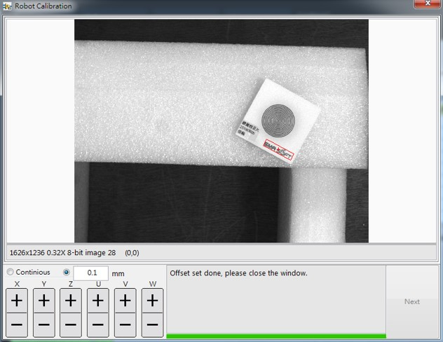
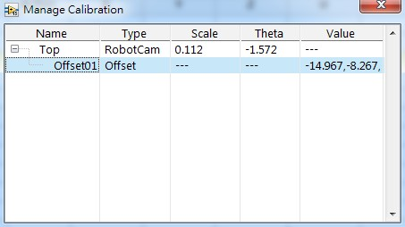

# 設定抓取點偏移補償（RobotCam）

#### 設定抓取點偏移補償（Set Offset）是針對 RobotCam 視覺引導點非同時為抓取點的應用。

* 前置準備
  * 請先移動手臂至拍照點。

## 開啟偏移補償設定功能

1. 右鍵點擊要進行操作的 SmaROBOT 模組，選擇 Vision Guide Setup。
2. 右鍵點擊已存在的 RobotCam 關係模型，選擇 Set Offset。
3. 於設定視窗中，填寫設定檔名稱，選擇視覺應用模組，與要使用的 Tool 工具編號。


Tool 會影響手臂到視覺引導點的位置。例如，若有一 Tool 1 偏移法蘭面中心 X: 50, Y: 30，則導引時，將以該 Tool 1 位置到達視覺導引點正上方。選擇 Tool 0，則是法蘭面中心會到視覺引導點正上方。

若在 Sequencer 流程中要以 Tool 點導引，則此處需選擇相對應的 Tool 設定 Offset。


## 開始補償偏移設定程序

### Stage 1

找到畫面中的目標座標後按下 Next ，將此樣品的位置及角度訂為標準值，往後的視覺導引將會用新的取像與此樣品位置比較，並引導手臂。

### Stage 2

樣品設定完成後點擊 Next ，手臂將會以工具點移至目標中心（工具點依照一開始的設定，可能為法蘭面中心或其他選用的 Tool 中心）。

### Stage 3

目前法蘭面中心（或 Tool 中心）應已在 Pattern 的正上方。此時可操作左下方的操控面板，移動工具點到抓取位置（若目標座標點即抓取位置則不需移動 XY）。若移動完畢，請點選 Next。

### Stage 4

Offset 設定完成，請點擊 Next 使手臂回到回到起始位置。

### Stage 5

在相機能拍到的範圍內，將要抓取的元件隨意移動，按下 Next 來測試工具點是否有成功移動到抓取點。

### Stage 6

若 Offset 設定正確無誤，此時工具點會在抓取位置，此時即可按下 Next 回到初始位置。

### Stage 7

設定 Offset 導引過程結束，可關閉視窗。

### Stage 8

若成功建立，Manage Calibration 視窗會多一項 Offset 數值。

