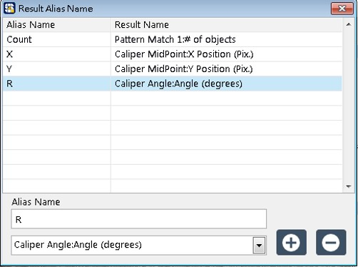

# 建立視覺應用模組

### 目標：建立實務上要辨識產品座標的視覺專案

* 前置準備
  * 移動手臂至拍照點。
  * 產品特徵盡量在畫面的中間處（視野範圍的的二分之一以內）。

## 建立與編輯視覺模組

#### 建立辨識樣品特徵用的視覺模組

1. 在模組列表中選擇 SmaVISION，右鍵點擊並選擇 Create new。
2. 為視覺模組命名。

#### 加入取像功能

1. 在影像處理函式列表的「Acquire Image」分類底下，選擇「IMAXQdx Image」進行取像。
2. 在「IMAXQdx Image」設定視窗中選擇相機，待畫面正常出現後，按下 OK 確認加入功能。


請調整焦距、光圈與光源至可清晰看到圓形圖案。


#### 加入抽色功能

1. 在影像處理函式列表的「Color」分類下，雙擊「Extract」使用抽色功能。
2. 在「Extract」設定視窗中，選擇色彩平面（通常選擇綠色即可）。
3. 確認畫面效果，完成後按下 OK 確認加入功能。

#### 加入辨識產品特徵的功能 1（Pattern Match）

1. 在影像處理函式列表的「Machine Vision」分類下，雙擊「Pattern Match」使用圖像比對功能。
2. 在「Pattern Match」的設定視窗中建立樣板並設定參數，框選 ROI 後點擊 Test 按鈕進行測試。
3. 確認可順利找到目標後，按下 OK 確認加入功能。

#### 加入辨識產品特徵的功能 2（Optional，此以 Caliper 影像處理函式為例）

1. 在影像處理函式列表的「Machine Vision」分類下，雙擊「Caliper」使用座標點計算功能。
2. 在「Caliper」的設定視窗中選擇計算方法並選擇座標點。
   1. Mid Point 計算兩個 Pattern Match 的座標點中心
   2. Angle from Horizontal 計算兩 Pattern Match 座標點連線與水平線之夾角
3. 確認完成後，按下 OK 確認加入功能。

#### 將指定的數值化名輸出

1. 點擊右下方的 Variable按鈕，叫出結果數值化名的設定視窗。
2. 選擇「Pattern Match」的其中一個 \# 數量，化名為「Count」。
3. 選擇「Caliper」的 Mid Point 中心 X 座標數值，化名為「X」。
4. 選擇「Caliper」的 Mid Point 中心 Y 座標數值，化名為「Y」。
5. 選擇「Caliper」的 Angle 角度，化名為「R」。
6. 以上步驟完成後，將會呈現下圖狀態。確認無誤後，即可關閉化名設定視窗。
7. 按下 SmaVISION 右上方的存檔按鈕，保存當前的視覺模組。


化名 Count、X、Y、R 是後續進行視覺導引設定時的避要數值，分別代表目標物的數量、X 座標、Y 座標、角度。


