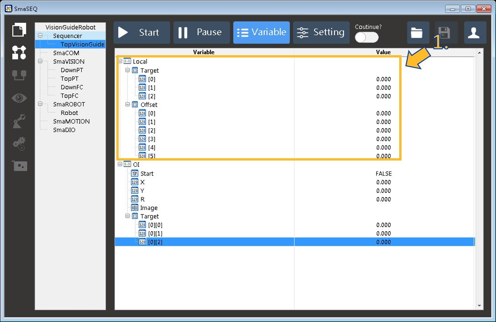
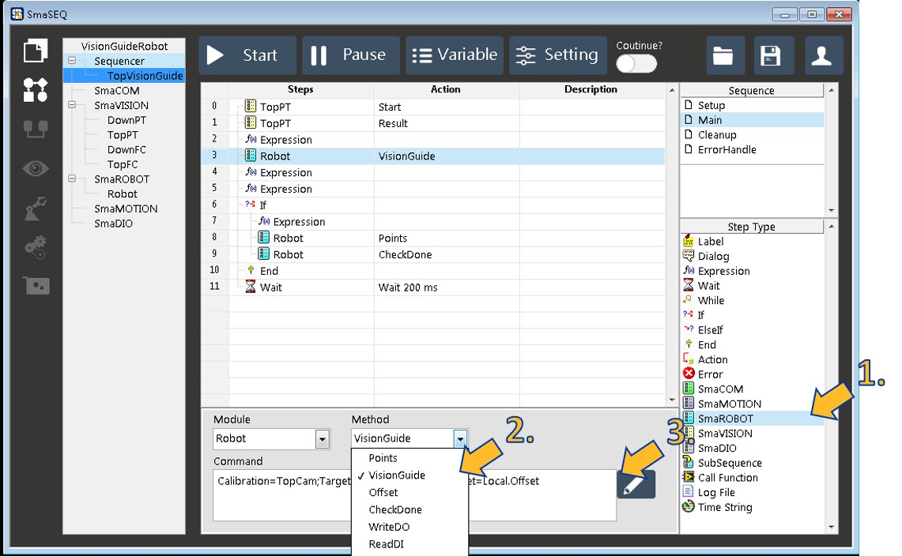
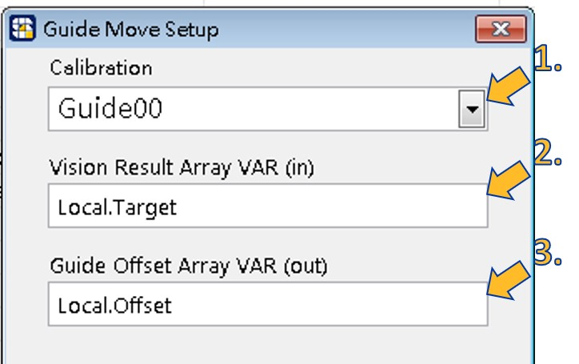
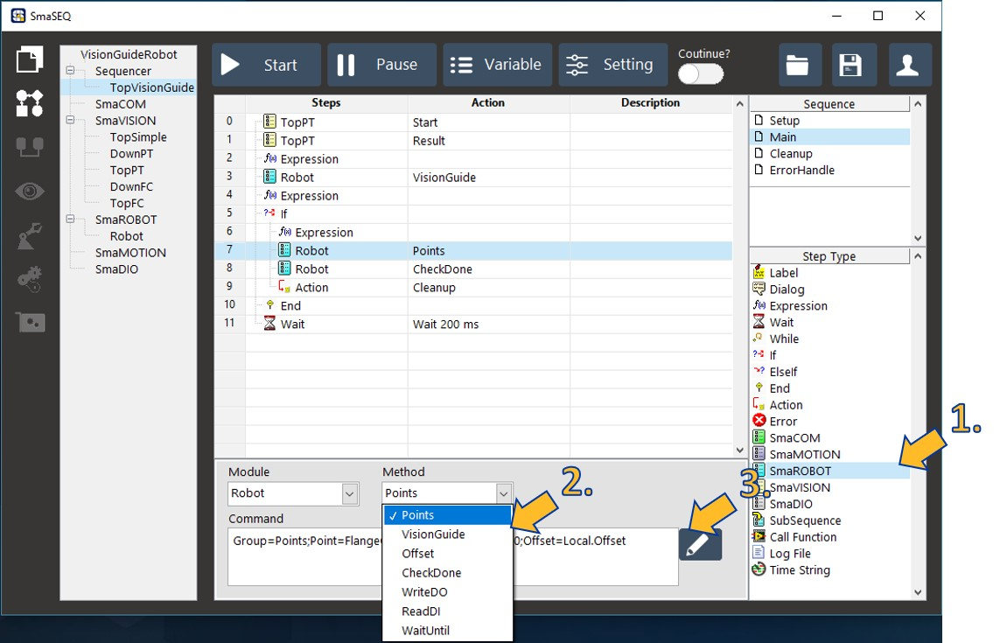
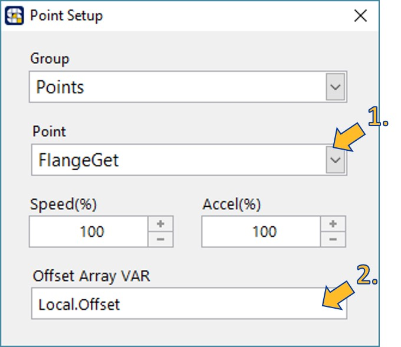

# 5.在 Sequencer 調用座標關係模型

## 流程圖

#### 編寫視覺導引的應用流程。

## 建立 Sequencer 流程

* **在變數表建立兩個一維陣列**
  * **規模為 3 的陣列 \* 1** （此以名為 Target 的陣列為例）
    * 此陣列用來記錄視覺模組得到的 \[ X , Y , R \]
  * **規模為 6 的陣列 \* 1** （此以名為 Offset 的陣列為例）
    * 此陣列用來儲存視覺導引計算的結果 \[ X , Y , Z , U , V , W\]

* **在流程中使用【SmaROBOT】步驟的 &lt; Vision Guide &gt; 指令**

1. 雙擊 【SmaROBOT】 步驟，加入流程。
2. 在 Method 選項點選 &lt; VisionGuide &gt;。
3. 點選鉛筆按鈕進行指令編輯。
   1. 選擇視覺導引的座標關係模型
   2. Vision Result Array 欄位填入 Target 陣列
   3. Guide Offset Array 欄位填入 Offset 陣列


【SmaROBOT】步驟的 &lt; Vision Guide &gt; 指令，會將影像得到的座標資訊，經過視覺導引的座標關係換算，得出手臂目前應該補償多少位移，才能到抓取點取得物品。


* **使用【SmaROBOT】的 &lt; Point &gt; 指令，指定拍照點為目標點，並帶入 &lt; Vision Guide &gt; 得到的補償值陣列作為補正。**

1. 雙擊 【SmaROBOT】 步驟，加入流程。
2. 在 Method 選項點選 &lt; Points &gt;。
3. 點選鉛筆按鈕進行指令編輯。
   1. 指定目標點
      1. RobotCam：拍照點
      2. DownCam：放置點
   2. 給予 Offset 陣列作為移動補正值

