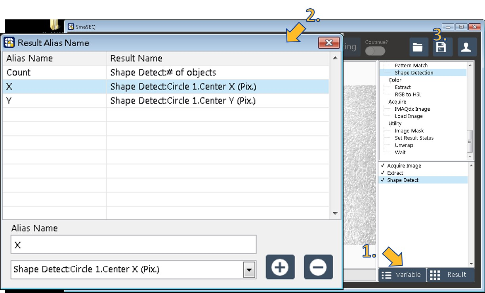

# 建立視覺校正模組

### 目標：建立可辨識校正片的視覺專案。

* 前置準備
  * 移動手臂至拍照點。
  * 校正片盡量在畫面的中間處（視野範圍的的二分之一以內）。


* 校正片為圓形圖案，亦可自行印製。
* 在調整手臂位置的同時，若想同時觀察視野範圍，可使用《影像監視器》


## 建立與編輯視覺模組

#### 建立導引設定用的視覺模組

1. 在模組列表中選擇 SmaVISION，右鍵點擊並選擇 Create new。
2. 為視覺模組命名。

#### 加入取像功能

1. 在影像處理函式列表的「Acquire Image」分類底下，選擇「IMAXQdx Image」進行取像。
2. 在「IMAXQdx Image」設定視窗中選擇相機，待畫面正常出現後，按下 OK 確認加入功能。


請調整焦距、光圈與光源至可清晰看到圓形圖案。


#### 

#### 加入抽色功能（若為黑白相機，請跳過此步驟）

1. 在影像處理函式列表的「Color」分類下，雙擊「Extract」使用抽色功能。
2. 在「Extract」設定視窗中，選擇色彩平面（通常選擇綠色即可）。
3. 確認畫面效果，完成後按下 OK 確認加入功能。

#### 加入找圓功能

1. 在影像處理函式列表的「Machine Vision」分類下，雙擊「Shape Detection」使用找圓功能。
2. 在「Shape Detection」的設定視窗中設定參數，點擊 Test 按鈕進行測試，直到找到圓為止。
3. 確認有找到圓後，按下 OK 確認加入功能。


* 若不確定圓的半徑為多少 Pixel，可先將「Shape」分頁下的 Min、Max 數值範圍加大，直到找到圓後，再縮小至適當範圍值。
* 若圓的邊界對比度不足，可嘗試降低 Edge Threshold。


#### 確認結果數值

1. 右下角的Result，即彈出視窗顯示測試結果。
2. 點擊影像處理流程的最後一步（Shape Detection），測試結果是否穩定。


* 點擊已加入的影像處理程序，SmaVISION 即會由上而下執行處裡程序一次。
* 執行已加入的影像處理程序時，若該程序執行順利，則會在該程序前顯示打勾標記。
* 影像視窗中，會以紅色標記標示找到的目標。


#### 將指定的數值化名輸出

1. 點擊右下方的 Variable按鈕，叫出結果數值化名的設定視窗。
2. 選擇「Shape Detect」的 X 中心座標數值，化名為「X」。
3. 選擇「Shape Detect」的 Y 中心座標數值，化名為「Y」。
4. 選擇「Shape Detect」的 \# 數量，化名為「Count」。
5. 以上步驟完成後，將會呈現下圖狀態。確認無誤後，即可關閉化名設定視窗。
6. 按下 SmaVISION 右上方的存檔按鈕，保存當前的視覺模組。


此處化名必須依照說明填寫，不可任意改動


