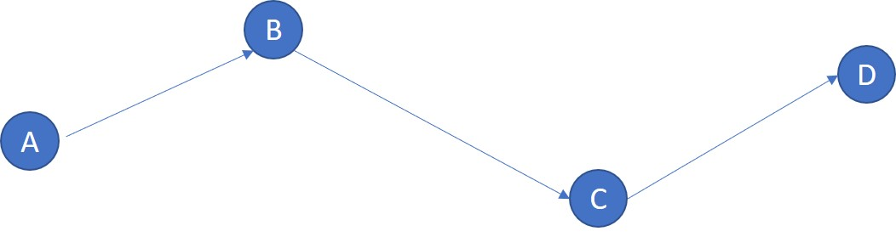
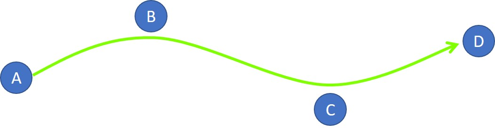

# 路徑規劃

#### 路徑規畫讓使用者可將多個手臂座標點串聯成軌跡，作為手臂移動時依循的路徑，如此可增加手臂的移動效率，以及避障的實用性。

1. **路徑列表**：此區列出目前已存在的路徑，使用者可自由新增、刪除。
2. **點位清單**：列出所有使用者已建立的手臂座標點位。
3. **路徑的點位順序表**：此表排列的順序即為手臂調用此路徑時的移動順序。
4. **路徑測試區**：設定好路徑後，使用者可指定起始點與終點，並觀察手臂移動的路徑是否符合正確。Switch 按鈕可調換起點與終點。
5. **途經點預覽表**：預覽起點與終點間所經過的路徑順序。

## 提升手臂移動效率

設定手臂的座標點時，座標點間若無建立關係，則使用者必須一個點一個點下達指令，手臂才能依照期望的路線行進，如此不僅使用上十分不便，手臂也會在每個點之間進行「加速 - 定速 - 減速」的過程，降低了手臂移動的效率。路徑規畫可串接固定使用的路徑點，讓手臂移動時有跡可循。

#### 一般移動方式：針對路徑點位，依序下達移動指令

1. 下達移動指令：B
2. 下達移動指令：C
3. 下達移動指令：D

#### 使用路徑規畫：手臂在路徑移動中不會停止，接近路徑點後即前往下一個點位。

1. 下達移動指令：D

## 強化避障的實用性

在設定手臂的運動路線時，常需躲避環境障礙物；路徑規劃的功能，可將手臂在空間中的座標點，劃分成若干條路徑，讓手臂依循路徑移動，進而可降低使用者在操作手臂移動時，因失誤而導致的撞機風險。

