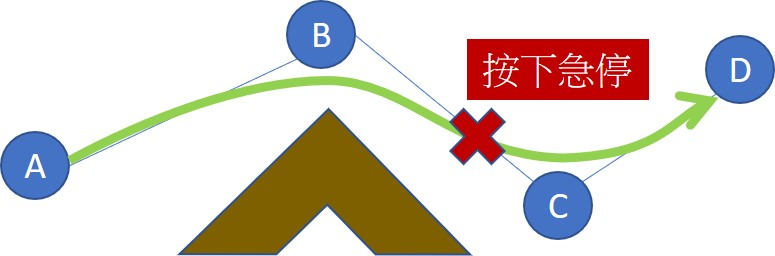
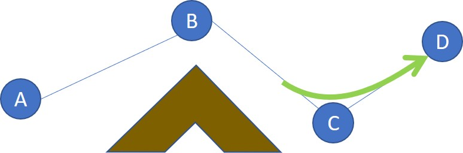

# 運行中斷與賦歸

#### 若在移動過程中按下急停，或是【SmaROBOT】步驟的 &lt; Point &gt; 指令有帶入 Offset，則手臂可能會存在於路徑點以外的位置。自動路徑規劃會找尋上一次移動的歷史路徑，並從中挑選最近的路徑點，進行移動路徑規劃。

### 停止後重啟

* 若目標為 D 點，手臂會找到最近的 C 點，並以 C 點進行路徑規畫至 D 點。

* 若目標為 A 點，手臂亦會找到最近的 C 點，再以 C 點進行路徑規畫運行 -&gt;C-&gt;B-&gt;A

