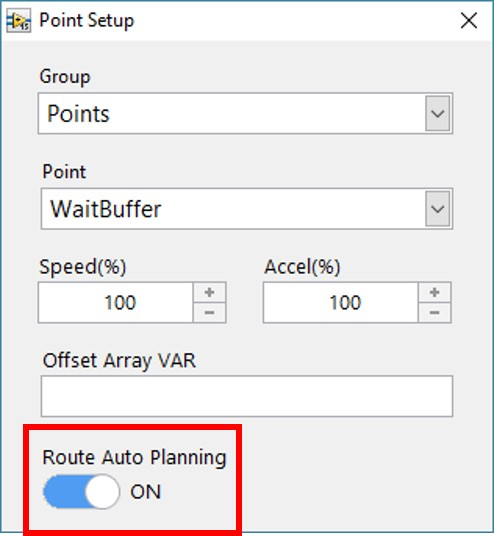
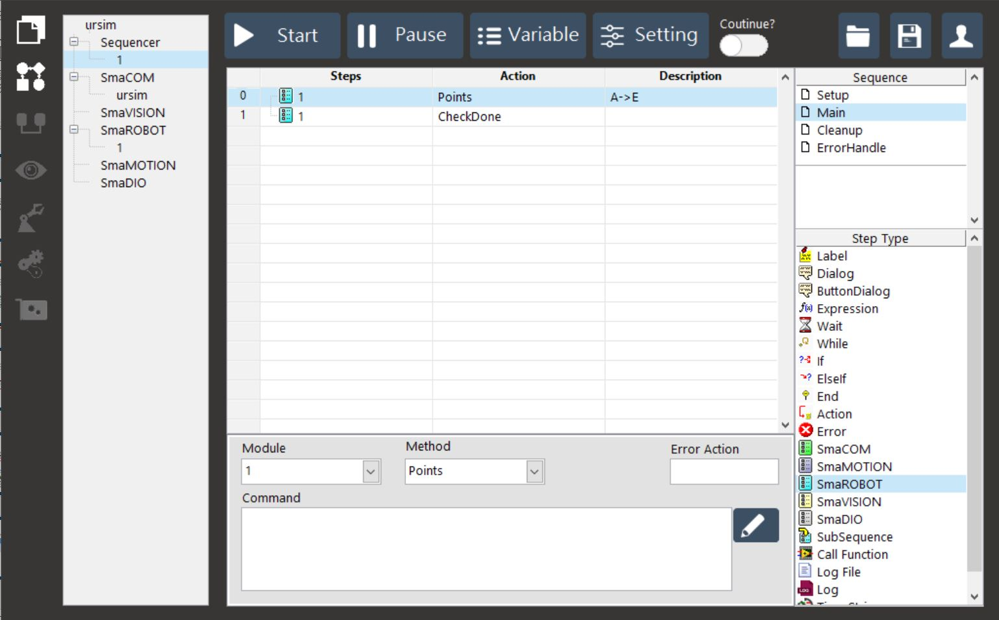
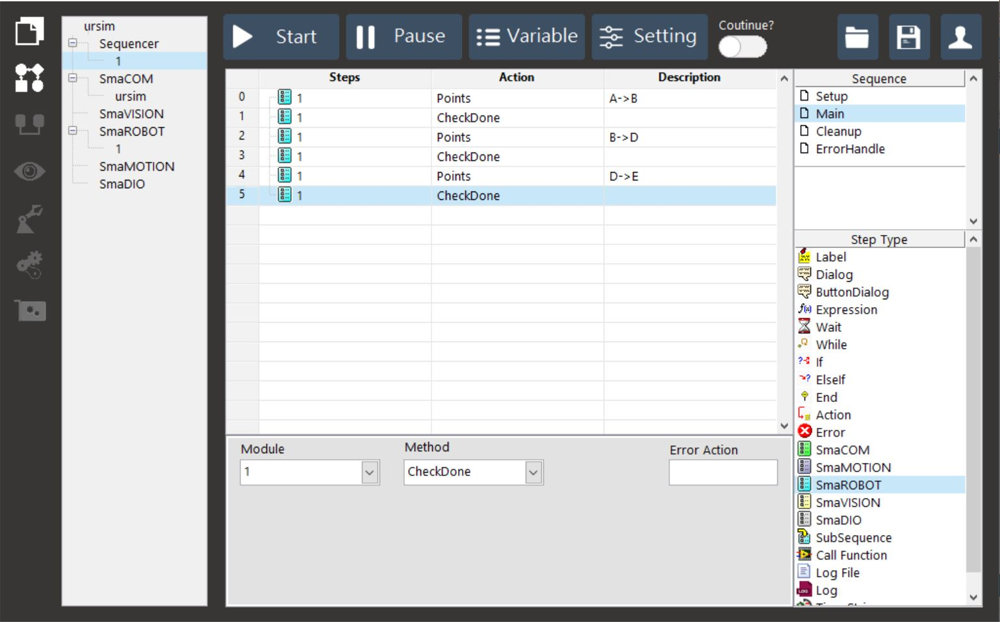

# 開啟 Sequencer 中的路徑規劃

#### Sequencer 使用【SmaROBOT】步驟的 &lt; Point &gt; 指令，對 SmaROBOT 模組下達移動命令時，可選擇是否開啟路徑規畫功能（Route Auto Planning）。

## Route Auto Planning 在流程中的差異比較

* **AutoPlan ON**
  * 流程中只需使用【SmaROBOT】步驟的 &lt; Point &gt; 下達一次終點的移動指令，手臂即會自動依循已設定的路徑平滑移動。

* **AutoPlan OFF**
  * 流程中需分別對路徑點位下達移動指令，且每段移動都會經過「加速 - 固定速度 - 減速」的過程。

