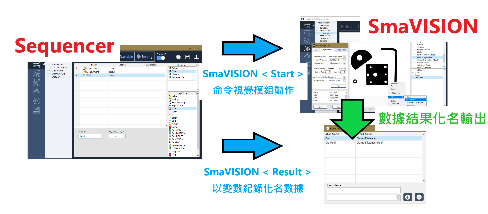
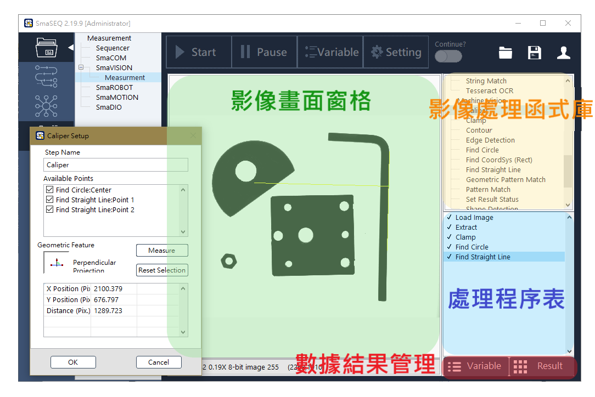

# SmaVISION模組

#### SmaVISION提供豐富且實用的影像處理方法，讓您能夠依照機台的視覺需求，靈活地設計專屬的視覺檢測項目。從簡單的取像與量測到複雜的 AOI 檢測，或是搭配手臂進行影像定位等，滿足多方應用的需求。

本章節將分成以下幾個主題介紹：

* 基礎影像概念
* 影像處理流程
* 影像操作
* 結果數據處理
* 影像函式列表

## 視覺模組 vs. 流程編輯器

#### SmaVISION 是一個預先設定好功能的被動角色，由 Sequencer

## 操作介面

#### SmaVISION 提供了簡單卻相當實用的操作介面，讓使用能夠同時進行機器視覺的開發與測試。

* **影像畫面窗格**
  * 顯示當前影像與標記
  * 在此窗格點擊滑鼠右鍵，可開啟操作輔助工具選單。
* **影像處理函式庫**
  * 陳列了所有 SmaVISION 提供的影像處理功能。
* **處理程序表**
  * 處理程序表排列了本視覺模組的運作順序。
  * 滑鼠點選程序中的步驟，可即時在畫面窗格看到成果。
* **數據結果管理**
  * 數據化名（Alias Name）
    * 將視覺模組的成果數據命名。流程編輯器中，可使用【SmaVISION】步驟函式的 &lt; Result &gt; 指令，將此化名指定儲存到對應的變數中。
  * 數據總覽（Result）
    * 點擊 Result 按鈕，可查看本視覺模組的所有數據結果。

