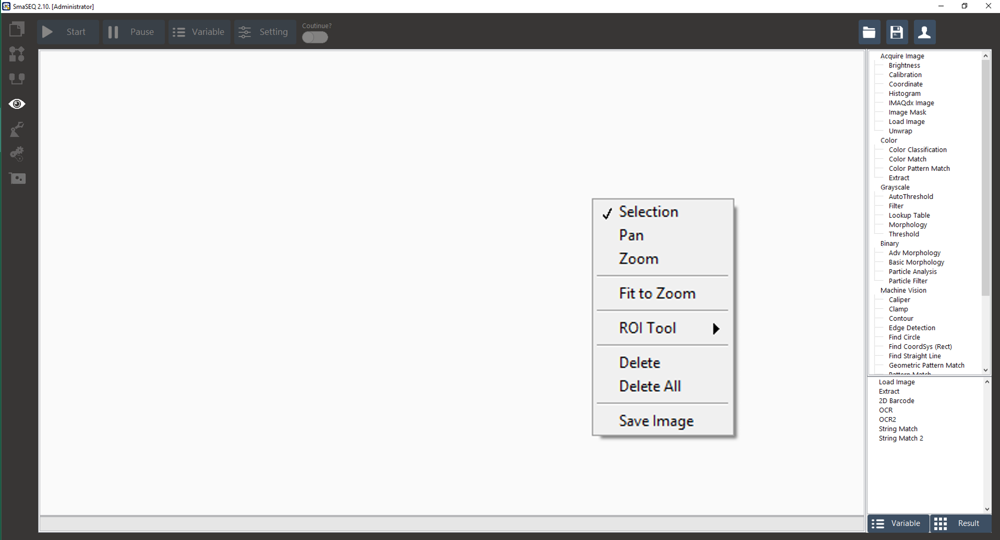

# 影像操作

## 操作影像視窗

在影像視窗中點擊右鍵，即可選擇各項調整工具。

* **Selection**: 選取工具
* **Pan**: 拖拉工具
  * 影像放大時，可使用拖拉工具調整視野範圍
* **Zoom**: 縮放工具
  * 以此工具點擊影像視窗，可方大畫面
  * 點擊影像視窗時，同時按著 Ctrl，可縮小畫面
* **Fit to Zoom**: 將畫面調整至填滿視窗
* **ROI Tool**: ROI 框選工具
  * 在編輯功能步驟時，常需要搭配ROI 框選工具使用
  * 依照不同的功能，需選擇適當的ROI 工具
    * Line - 線型
    * Rectangle - 方形
    * Rotated Rectangle - 可旋轉型
    * Annual - 同心圓型
* **Delete**: 刪除ROI
* **Delete All**: 刪除所有ROI
* **Save Image**: 儲存當前影像\(RGB / Grayscale\)。

