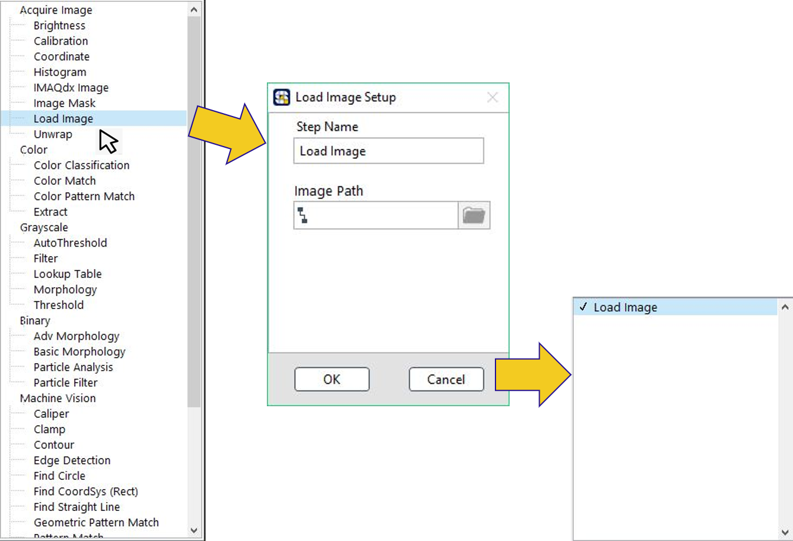
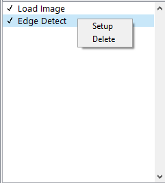

# 影像處理步驟編輯


有關影像處裡的各步驟說明，請參考附錄《影像處理函式》


## 在影像函式庫中選擇需要的功能，雙擊加入函式並設定參數

1. 在影像處理功能函式上雙擊滑鼠左鍵，開啟設定視窗。
2. 框選適合的 ROI （依據函式而不同）
3. 設定該函式的參數
4. 按下 OK ，將該功能加入影像處理步驟中。

## 重新編輯函式 / 刪除函式

在影像處理步驟區域，點選欲編輯之功能後，右鍵點擊該步驟，即可選擇再次編輯或刪除。

