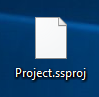
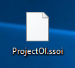

# 基本介紹 - 「專案檔」與「操作員介面檔」

### 在使用 SmaSEQ 時，我們必須認識兩個重要的檔案

* **專案檔 \(SmaSEQ Project File\) :** 所有的專案內容、模組設定參數等資訊，都儲存在這個檔案中。
  * 其附檔名為 _**.ssproj**_。

* **操作員介面檔 \(SmaSEQ Operator Interface File\) :** 若使用者有自定義操作員介面，則所有操作員介面的相關設定皆會記錄在這個檔案中。
  * 其副檔名為 _**.ssoi**_。

