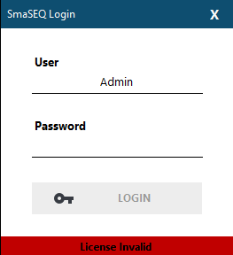
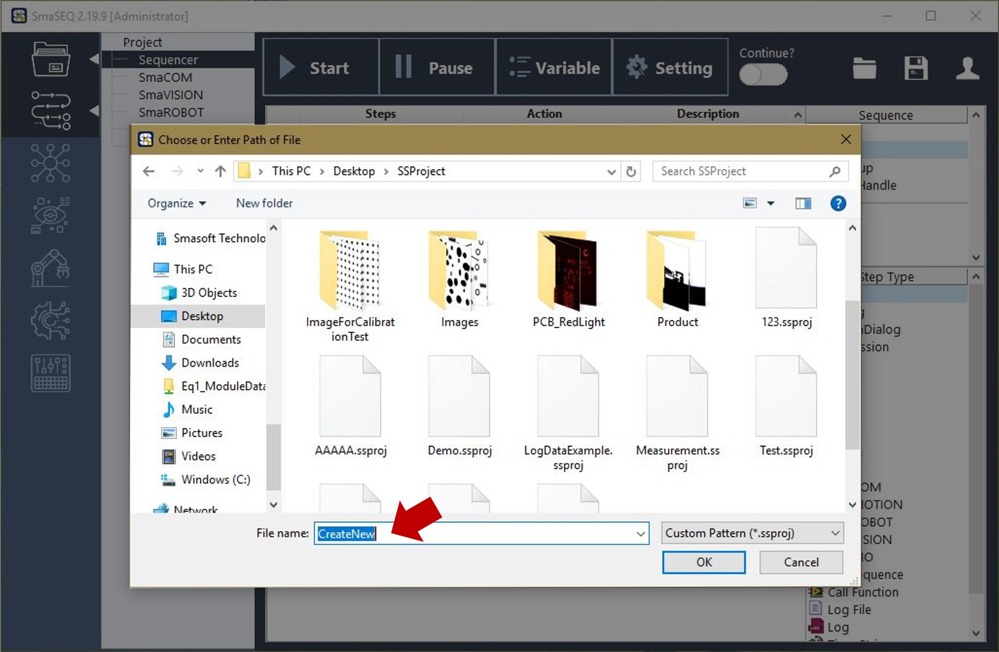
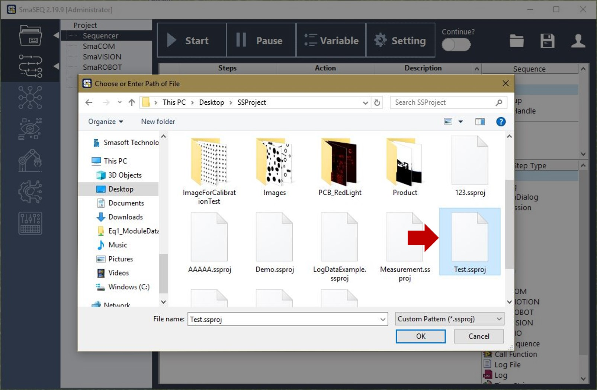
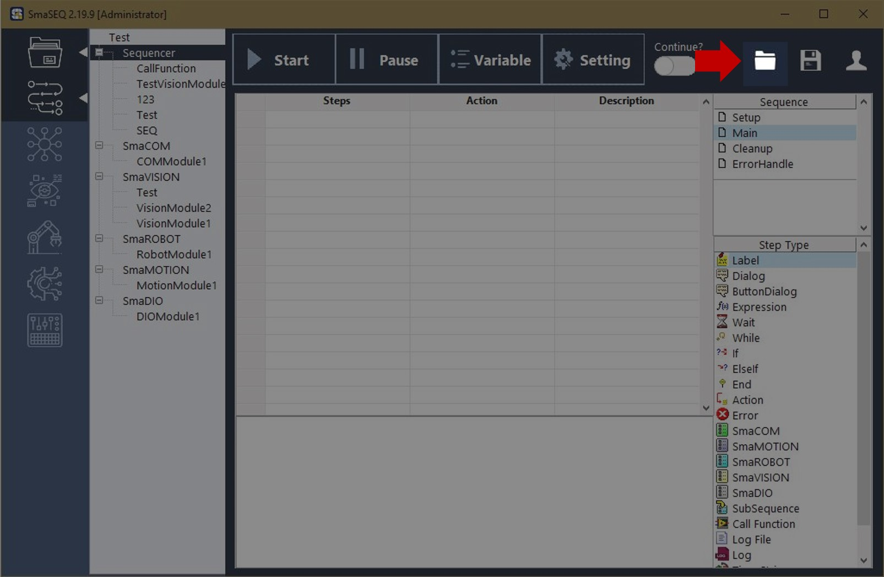

# 開始您的SmaSEQ專案

## 執行 SmaSEQ

#### 執行 SmaSEQ.exe，稍待片刻後，會出現登入畫面。

若軟體授權已啟用，下方燈號應為綠色，顯示 "License Valid"；

若軟體授權未啟用\(或失效\)，下方燈號則為紅色，顯示 "License Invalid"

## 登入帳戶

#### 若軟體授權成功認證，則可登入使用者帳戶 \(使用者帳戶權限可以在登入後進行編輯\)

* User：使用者名稱 \(預設為 Admin\)
* Password： 只用者密碼 \(預設為空\)

## 新建 / 開啟專案

#### 成功登入後，SmaSEQ 會自動引導使用者建立新專案，或開啟舊專案

* **建立新專案**
  * 請直接在 File name欄位輸入新專案的名稱。

* **開啟舊專案**
  * 請選擇已存在的專案檔\(.ssproj\)

#### 

#### 若是 SmaSEQ 已開啟的狀態下，使用者也能夠點選右上角按鈕，新建新專案或開啟其他專案，操作方式如上個步驟所示。

