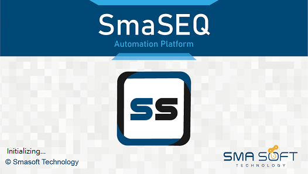
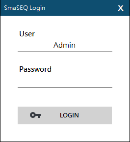
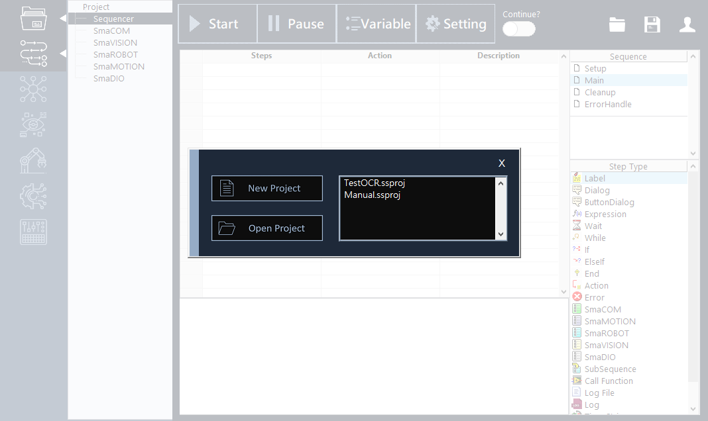
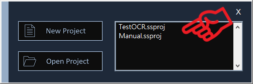
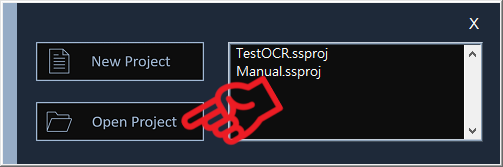

# 開啟您的 SmaSEQ 專案

## 執行 SmaSEQ

#### 執行 SmaSEQ.exe。

#### 若軟體授權已啟用，稍待片刻後會出現登入畫面。

## 登入帳戶

#### 使用 SmaSEQ 的預設帳戶即可登入，使用者帳戶權限可使用 SmaUtilities 的 Account 功能進行管理。

* User：使用者名稱 \(預設為 Admin\)
* Password： 只用者密碼 \(預設為空白\)

## 新建 / 開啟專案

#### 成功登入後，SmaSEQ 會引導使用者建立新專案，或開啟舊專案

* **建立新專案**
  * 選擇 New Project，選擇專案存放路徑，在 File name 輸入新專案的名稱後按下 OK。

* **開啟舊專案**
  * 選擇已存在的專案檔\(.ssproj\)。

* **最近開啟的專案**
  * 載入畫面右方會顯示最近開啟的專案，供使用者可直接點選。

### 若是 SmaSEQ 已開啟的狀態下，使用者也能夠點選右上角按鈕，新建新專案或開啟其他專案，操作方式如上個步驟所示。

