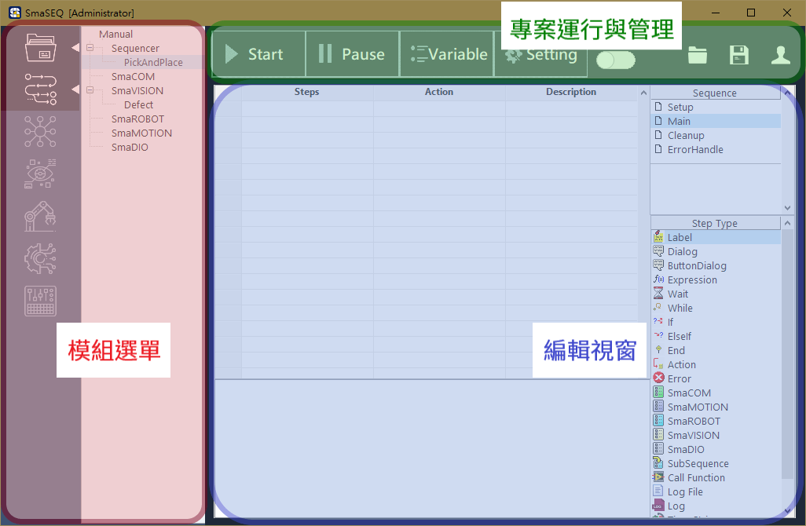
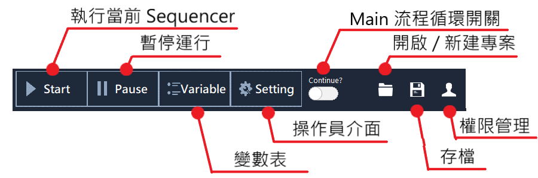

# SmaSEQ 版面配置

SmaSEQ 的畫面主要可分為三個部分：

* 模組選單
* 專案運行與管理
* 編輯視窗

## 模組選單

SmaSEQ 的可選用模組有：

* SmaCOM
* SmaVISION
* SmaROBOT
* SmaMOTION
* SmaDIO

一個專案中，使用者可建立並編輯多個模組，並在 Sequencer（流程編輯器） 中調用這些模組。在模組選單中，使用者可新增、刪除模組，亦可在模組間相互切換與編輯。詳細的操作方式，請參閱《[模組介紹 - 基本操作說明](https://smasoft.gitbook.io/smaseq-manual/mo-jie/mo-cao-zuo-you-xin-zeng-chu-zhong-xin-ming-ming-an-guan)》。

## 專案運行與管理

此區塊包含了專案的運作、變數與人機介面的設定、專案的操作與使用者權限的控管，如下圖所示 :

* **執行 / 終止運行 Sequencer：**開始執行當前的 Sequencer，依序為 Setup - Main - Cleanup 執行緒。
* **暫停流程：**暫停執行中的 Sequencer。再次點擊即可解除暫停狀態。
* **變數表：**切換至變數表。詳細操作說明請參閱《Variable - [變數表](../mo-jie/liu-cheng-mo/biao/)》。
  * 流程在編輯狀態時，切換至變數表可進行編輯，包含變數增減、命名、初始值設定等
  * 流程在運行狀態時，可開啟動態變數監視器，即時觀察變數數值。
* **操作員介面：**可呼叫操作員介面的設定與編輯視窗，詳細說明請參考《[設計您的操作員介面](../mo-jie/liu-cheng-mo/nin-de-cao-zuo-zhe-jie-mian/)》。
* **Main 流程循環開關：**
  * 關閉時，流程會依序執行 Setup - Main - Cleanup 一次即結束。
  * 開啟時，流程會在 Main 中不斷循環，直到流程被終止或開關被關閉。
* **開啟 / 新建專案：**點擊此按鈕會開啟檔案瀏覽器，使用者可新增專案，或載入舊專案。詳細說明請見《開始您的 SmaSEQ 專案》
* **存檔：**儲存當前編輯頁面至專案。各模組經編輯後必須存檔，始能在流程運行時套用。
* **權限管理：**可由此登入其他帳戶，或以管理員身分進行 SmaSEQ 權限編輯。

## 編輯視窗

此視窗是用來進行各模組內容的編輯，關於編輯方式，請參閱《模組介紹》中的各模組說明。

