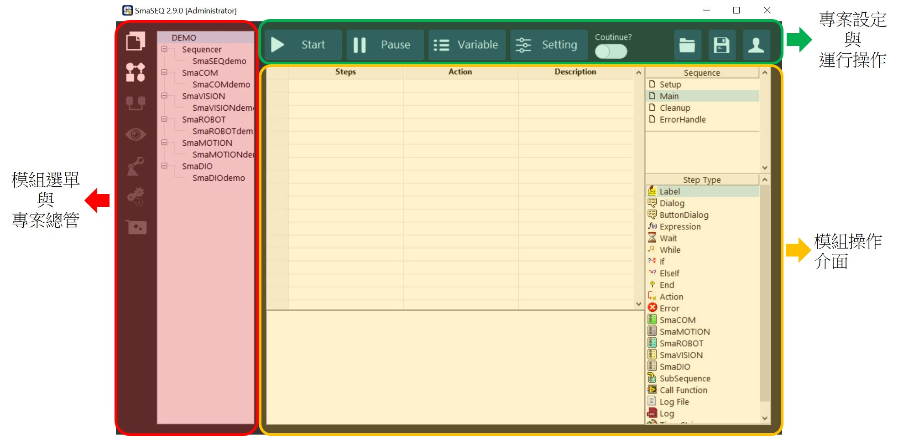
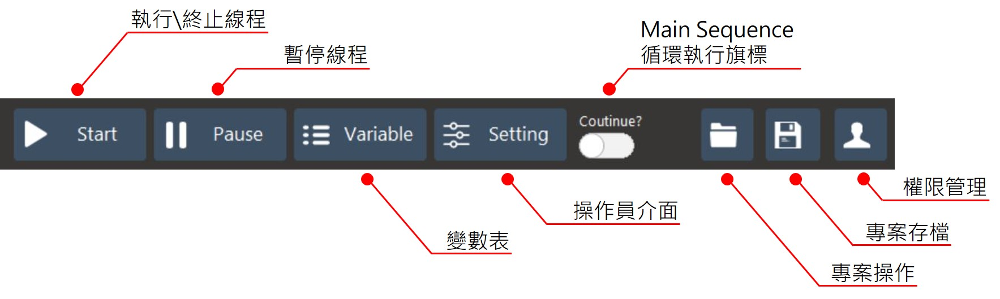

# SmaSEQ 版面配置

主畫面有三個部分，分別為 :

* 模組選單與專案總管
* 專案設定與運行操作
* 模組操作介面

## \# 模組選單與專案總管

使用模組選單能夠在不同的功能模組之間進行切換，而專案總管則是用來監看線程專案中包含的所有模組專案，以及模組專案的新增、刪除和重新命名等操作，進一步的使用說明可參考\[[專案總管](../mo-jie/mo-cao-zuo-you-xin-zeng-chu-zhong-xin-ming-ming-an-guan.md)\]。

## \# 專案設定與運行操作

此區塊包含了專案的運作、變數與人機介面的設定、專案的操作與使用者權限的控管，如下圖所示 :

* **執行\終止運行：**按下後即可執行或終止您所編寫的線程。
* **暫停流程：**暫停所有設備當下的工作，解除後從中斷的動作繼續執行。
* **變數表：**呼叫出變數表進行編輯或監看，詳細操作說明請參考\[[變數表](../mo-jie/liu-cheng-mo/biao/)\]。
* **操作員介面：**呼叫出操作員介面的設定與編輯視窗，詳細請參考說明\[[設計您的操作員介面](../mo-jie/liu-cheng-mo/nin-de-cao-zuo-zhe-jie-mian/)\]。
* **Main 流程循環開關：**開啟或關閉旗標來決定是否重複執行主要流程。
* **專案操作：**類似專案檔瀏覽的功能，用於新增或開啟專案檔。
* **專案存檔：**儲存專案檔編輯的功能，在線程編寫的過程中記得時常進行儲存動作。
* **權限管理：**

## \# 模組操作介面

模組操作介面會隨著使用者所選擇的模組不同而變換，各個模組介面的說明與操作方法請參考每個模組各自的章節 :

