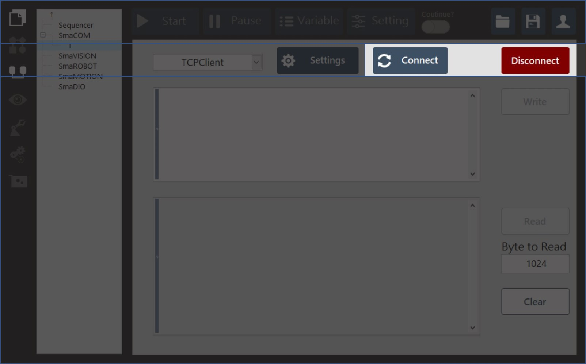
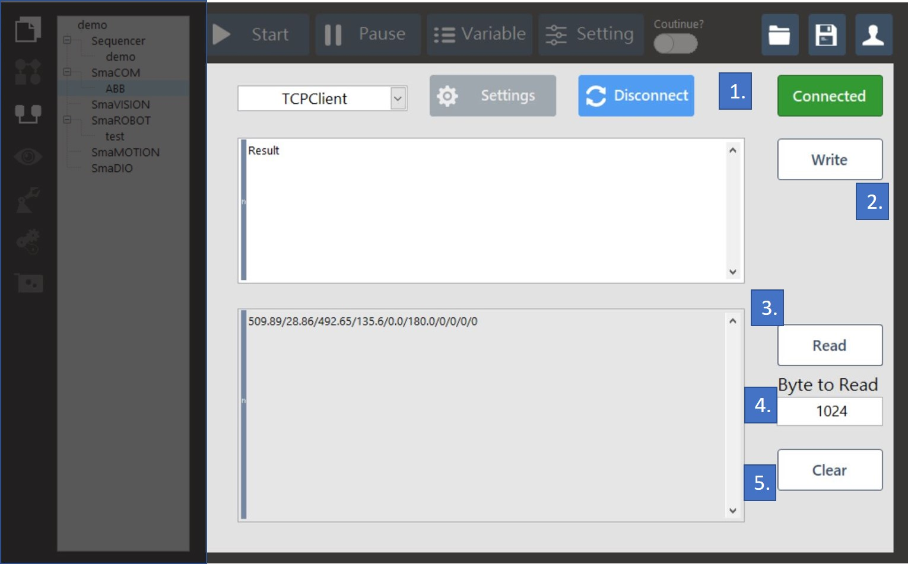

# 通訊測試\(connect、disconnect、write、read、clear\)

* 通訊設定完成後，按下"Connect"即可開始通訊測試是否成功：

* 若連線成功即可測試 讀/寫 功能：

1. 若連線成功，會變成綠色框"Connected"的圖樣。
2. 傳送寫入按鍵，會將白色視窗中的資料傳送。
3. 接收讀取按鍵，會將接收到的資料顯示在灰色視窗中。
4. 接收byte數量設定，預設為1024個byte。
5. 清除灰色對話視窗中的資料。

