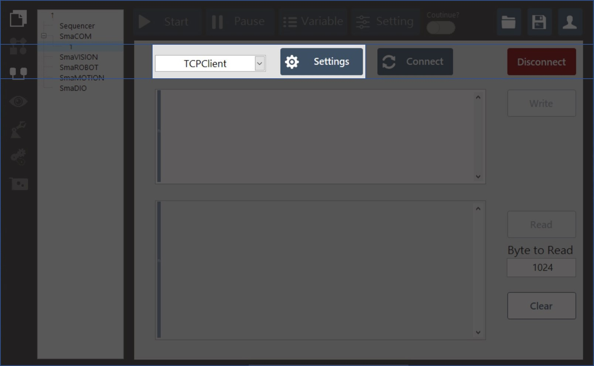
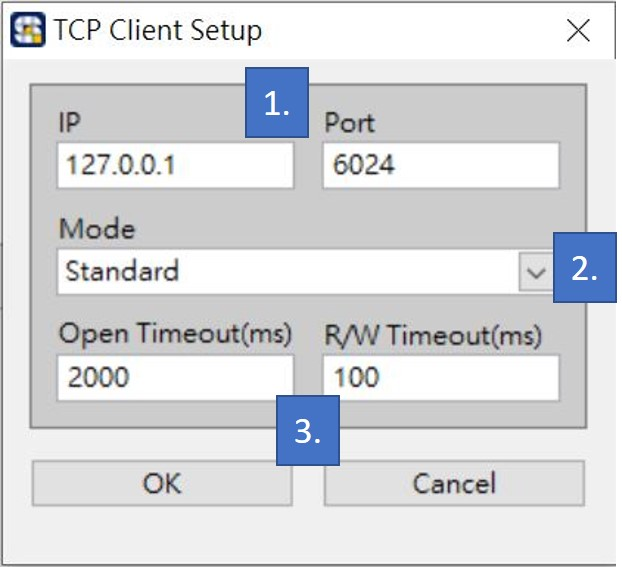

# TCPClient與設定參數

* TCPClient功能位於SmaCOM上方處：

* 點擊"Settings"後會出現以下視窗：

  ​

1. IP/Port設定欄位，預設為"127.0.0.1/6024"。
2. 接收與查看資料格式設定，預設為Standard、Buffered、CRLF與Immediate模式。
3. Standard\(預設\)：等待讀取所指定的bytes到達或是Client讀取時間逾時為止，並回傳目前接收到的byte。若byte數量少於Client需求的數量，會回傳部分的byte並報告超時錯誤訊息。
4. Buffered：等待讀取指定的bytes到達或是Client讀取時間逾時為止。若byte數量少於Client需求的數量，不會回傳任何的byte數量並報告超時錯誤訊息。
5. CRLF：等待讀取所指定的bytes到達或是讀取到CR\(Carriage-Return\)與LF\(Line Feed\)換行符號與Client讀取時間逾時為止。若在字串中接收到CRLF符號，會回傳接收到的byte包含CR與LF符號。
6. Immediate：等待讀取所指定的任何bytes到達，直到沒有資料而Client讀取時間逾時為止，並回傳接收到的byte數量。若函數沒有收到byte，則回傳超時錯誤訊息。
   1. 與Server連線逾時設定與資料 傳送/接收 讀/寫 逾時時間設定。

