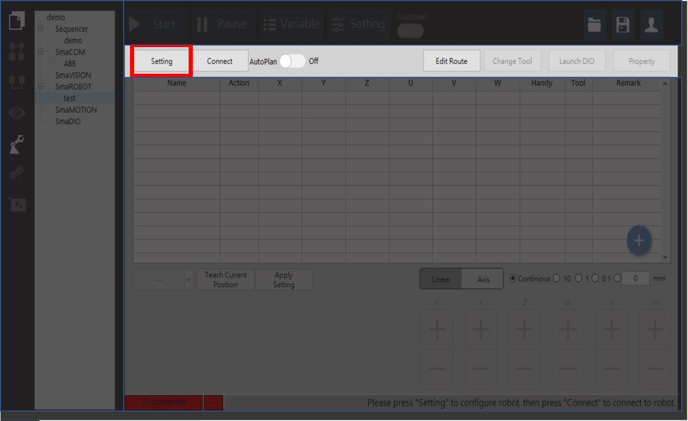

# 連線設定\(IP、連線時間、移動時間\)

手臂控制器的溝通主要是以IP address為主，SmaRobot擁有簡單的小視窗設定連線功能，以下為SmaRobot當中的連線設定介紹。

* 手臂連線設定位置在SmaRobot操作介面左上方紅色框處：

* 點擊後會出現以下視窗：

1. **IP Address**：設定機械手臂的IP，預設值為"192.168.0.1"。
2. **連線時間**：設定手臂傳送指令的連線時間，預設值為2000毫秒。
3. **移動時間**：手臂點對點移動指令的等待時間，預設值為20秒。

