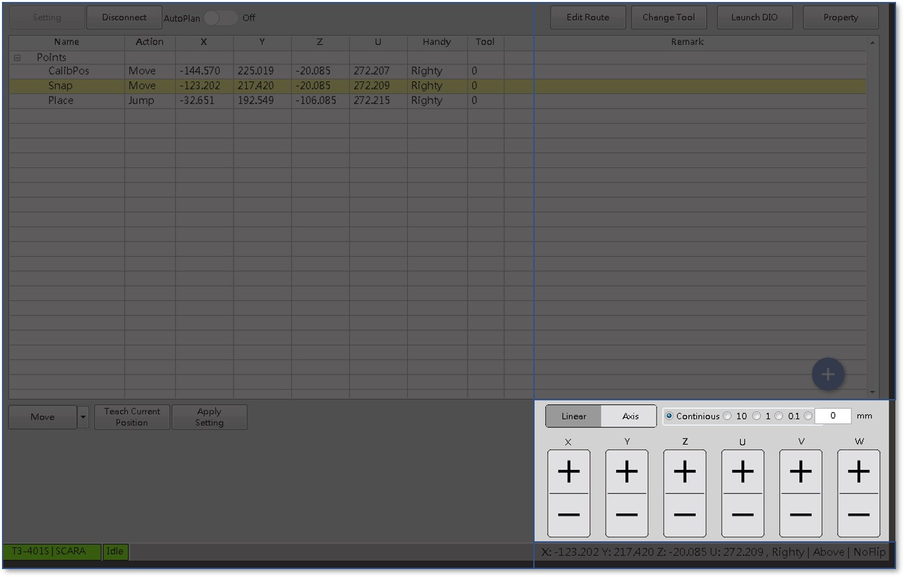
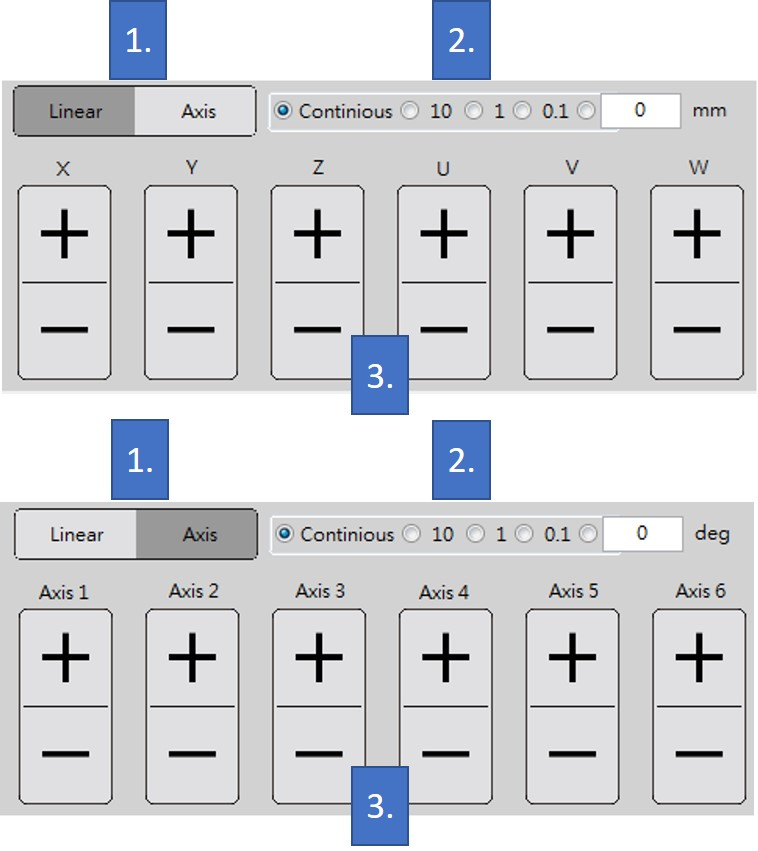

# 手臂控制面版\(Linear、Axis、移動距離設定\)

機械手臂的初步校正點位、控制手臂移動是需要一個簡單明瞭的控制面板來操作手臂，SmaRobot的手臂控制面版具有即時切換Linear與Axis的選項提供使用者依照需求操作，以下為SmaRobot的手臂控制面版的介紹。

* 手臂控制面版位置就在SmaRobot的操作介面右下邊位置：

* 手臂控制面版部分可分成兩種模式：世界座標與關節座標。

1. **世界座標模式\(Linear\)與關節座標模式\(Axis\)轉換鈕**：分別點擊呈現上圖模式。
2. **手臂控制移動距離設定**：選擇分別為連續移動或是吋動的距離。
3. **手臂控制方向鈕**：依照手臂位置移動需求點擊移動。

