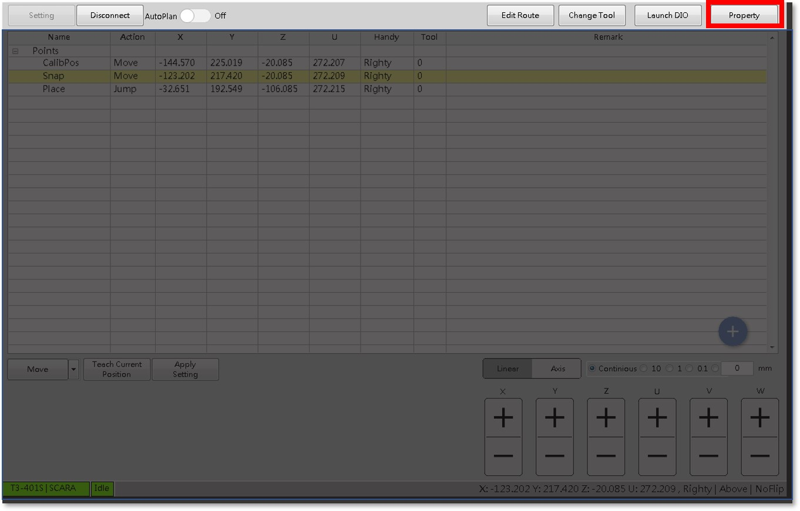
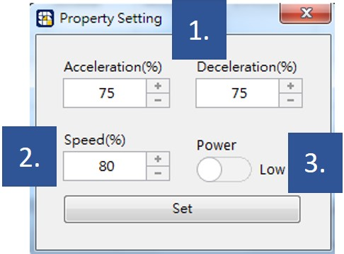

# 手臂速度設定

機械手臂運行的速度控制是使用者關心的議題之一，SmaRobot規劃一個小視窗讓使用者可以依照當下情況來調整與掌控手臂的移動速度，以下介紹SmaRobot的手臂速度設定。

* 手臂速度設定位置在SmaRobot操作介面之右上方紅色框處：\(注意，需要手臂連線後才啟用\)

* 點擊後會依照不同手臂廠牌出現以下視窗：

1. **移動加減速度控制鈕**：手動調整該手臂之加減速度百分比，手臂全速運動為100%。
2. **移動速度控制鈕**：手動調整該手臂之移動速度百分比，手臂全速運動為100%。
3. **功率大小調整鈕**：手動調整該手臂之輸出功率大小。

