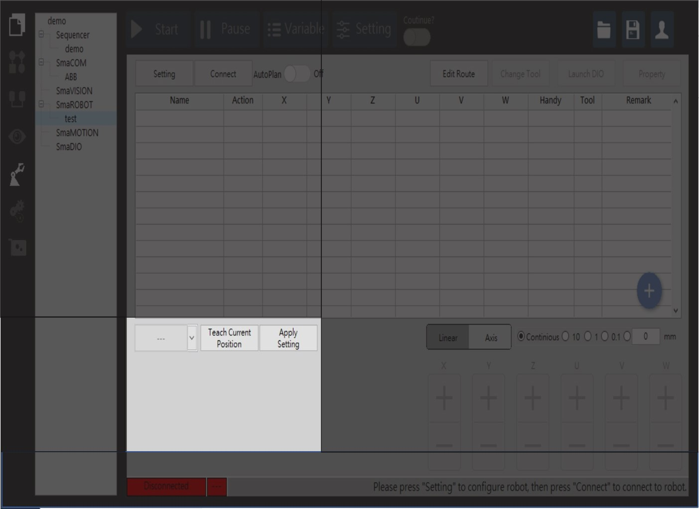
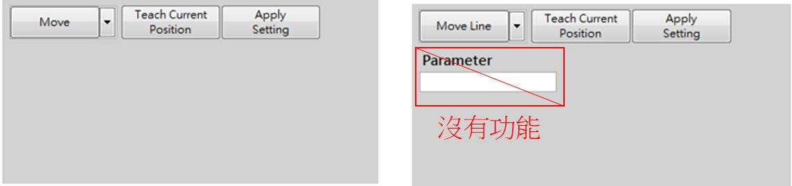
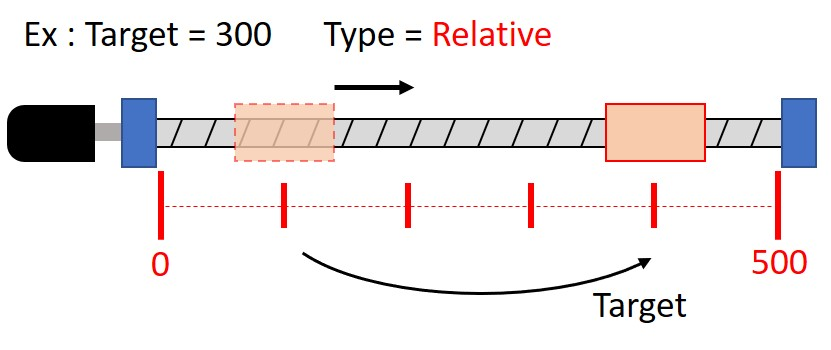
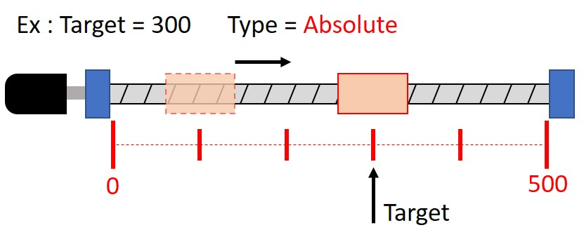
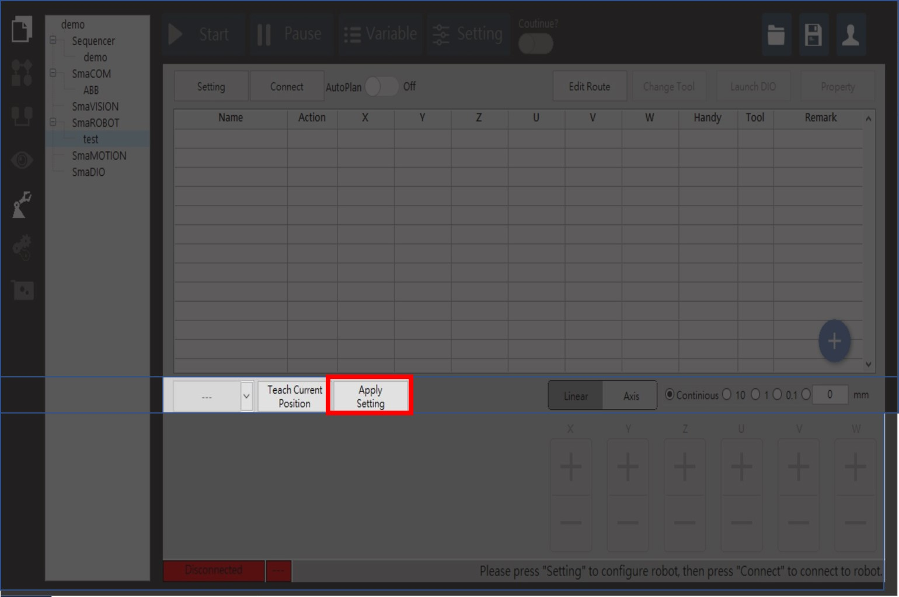

# 移動方式\(move、moveline、jump、手臂點位移動\)

機械手臂移動的方式主要分為點對點\(PTP\)與直線插補\(Line\)模式，SmaRobot操作介面做了簡單的區塊針對手臂的移動方式做整合，以下為SmaRobot的移動方式介紹。

* 設定手臂的移動方式在SmaRobot介面左下角位置\(注意，需要與手臂連線後啟用\)：

* SmaRobot手臂移動方式分成三種：Move、MoveLine與Jump。

1. Move：以Point-To-Point的模式進行移動。
2. MoveLine：以直線插捕的模式移動。
3. Jump：以門控運動模式進行Point-To-Point的移動
4. Jump運動模式設定分為相對運動\(Relative\)與絕對運動\(Absolute\)

* 設定完成後，記得點擊"Apply Setting"存取設定值。

