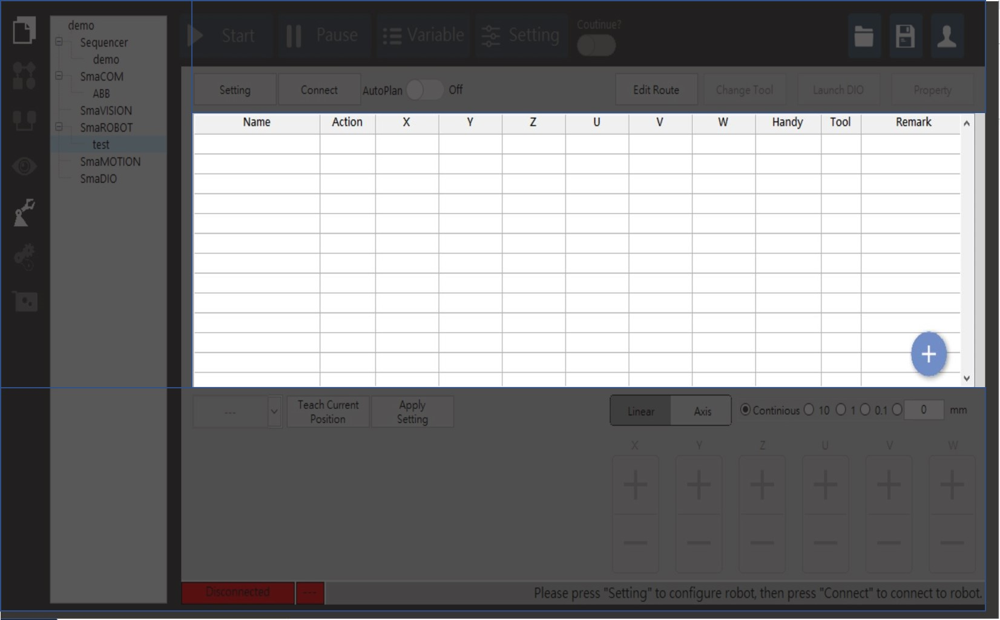
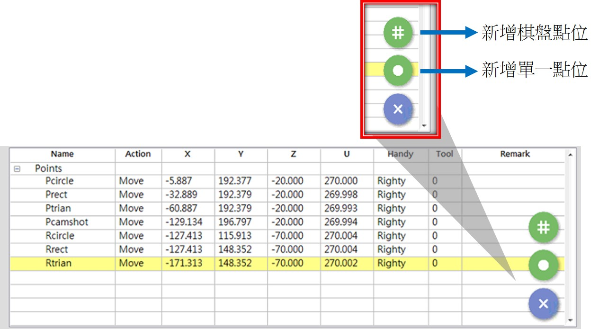

# 點位表\(新增、移除、單點、棋盤點\)

使用者操作手臂時都會記錄當下點位來完成手臂的應用，SmaRobot規劃一個簡單明瞭的介面讓使用者一目了然，以下是針對SmaRobot的點位增減做介紹。

* SmaRobot點位表就在介面中明顯處\(預設是藍色帶有加的符號\)：

* 在手臂點位表可以 新增/編輯/監看 專案中的手臂點位。

1. Name：點位名稱。
2. Action：運動模式。
3. X/Y/Z/U/V/W：點位座標資訊。
4. Handly：手臂姿態。
5. Tool：工具編號。
6. Remark：註解。

