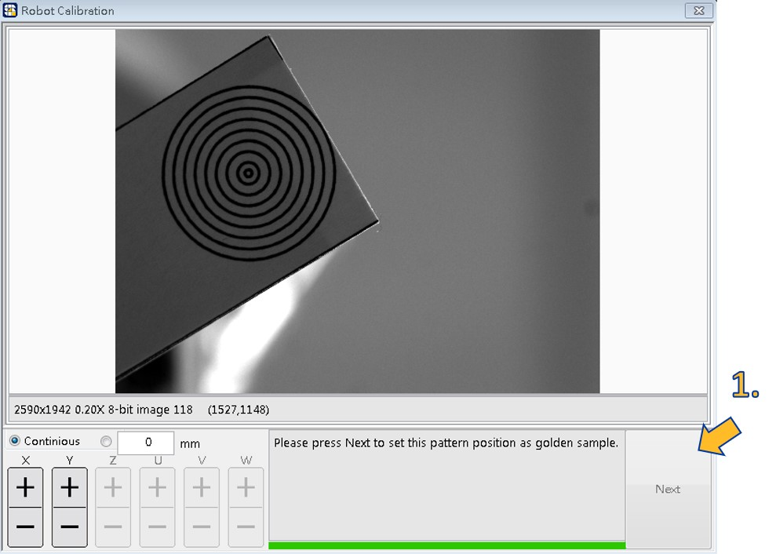

# 設定Golden\(DownCam\)

設定DownCam精確定位的位置與角度標準值。

* 建立Golden Sample：

1. 右鍵點擊先前建立的SmaRobot模組，選擇Vision Guide Setup。
2. 在先前建立DownCam校正右鍵點擊Set Golden Sample。
3. 在彈出視窗填寫名稱及要使用的專案名稱。

1. 點擊Next設定目前此Pattern位置為標準值。
2. 結束校正。

