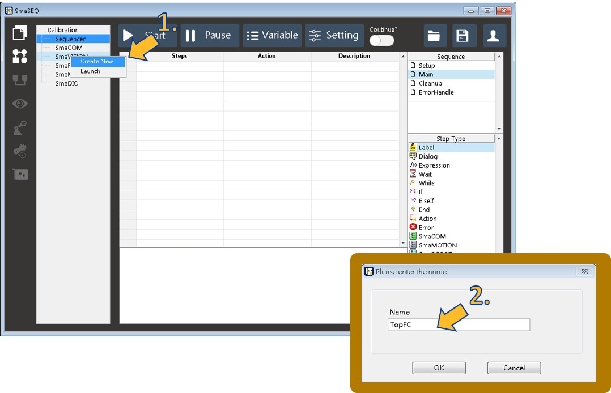
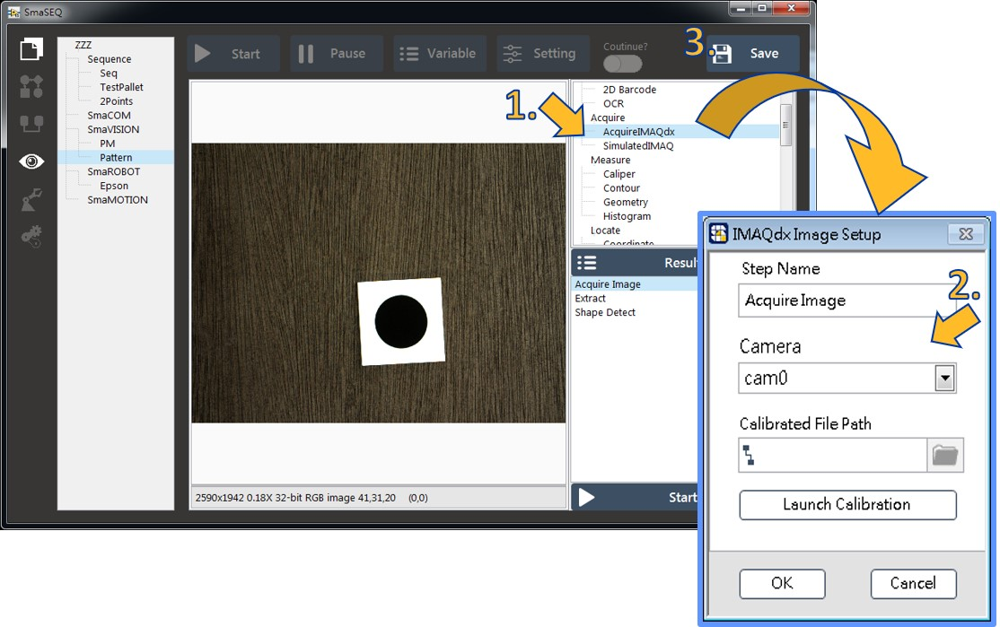
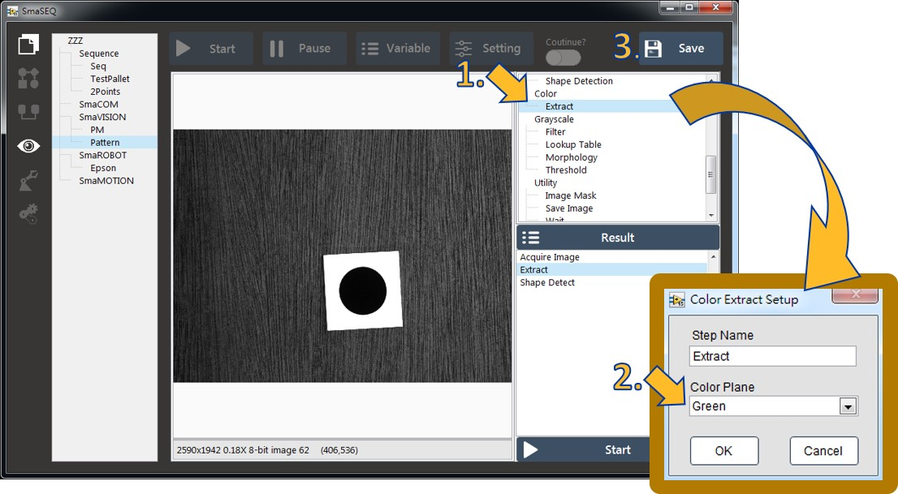
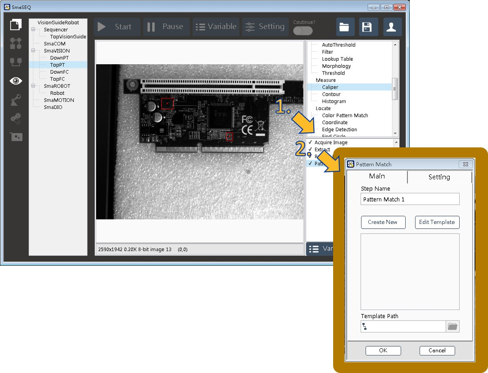
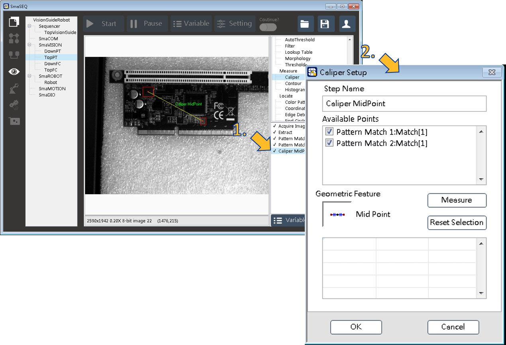
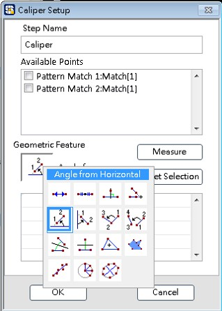

# 樣品視覺專案設定

建立定位樣品位置和旋轉角度的視覺專案。

* 前置準備：移動手臂至拍照點\(若校正為DownCam，須將拍照點的U軸轉換成0\)。

1. 右鍵點擊SmaVision，點選Create new。
2. 為本視覺模組命名。

* 接著編輯影像模組來取得圖像：

1. 在Acquire的選項中選擇AcquireIMAXQdx來新增取像功能。
2. 在彈出視窗中選擇相機，這時會在影像視窗中看到連續影像，並選擇ok。
3. 記得點擊右上角的儲存。

* 調整焦距與光圈：

1. 在專案列表按右鍵選取剛建立的專案，選擇Launch。
2. 此時介面會連續取像並調整成適當的焦距與光圈。
3. 影像顯示視窗可點擊右鍵選取"放大工具"。

* 對圖像做灰階設定\(此步驟僅彩色相機需要\)：

1. 在Color的選項中點擊Extract進行抽色。
2. 彈出視窗中選擇色彩平面\(通常選擇Green\)。
3. 記得點擊右上角儲存。

* 編輯影像模組Pattern Match。

1. 在Locate的選項點擊Pattern Match。
2. 在彈出視窗中設定樣板，並在影像顯示區設定要搜尋的ROI。\(建議設定兩個Pattern Match並接著使用Caliper增加穩定性\(後續\)\)

* 編輯影像模組Caliper：

1. 在Measure的選項點擊Caliper。
2. 使用MidPoint功能，找兩個Pattern Match的中點。
3. 使用Angle from Horizontal功能，找兩個Pattern Match的角度。

