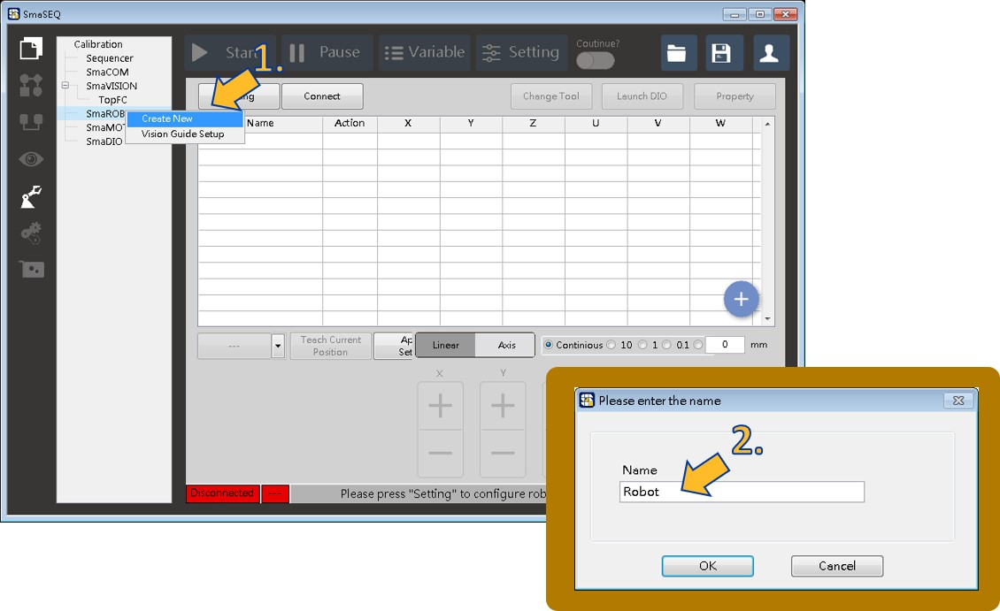
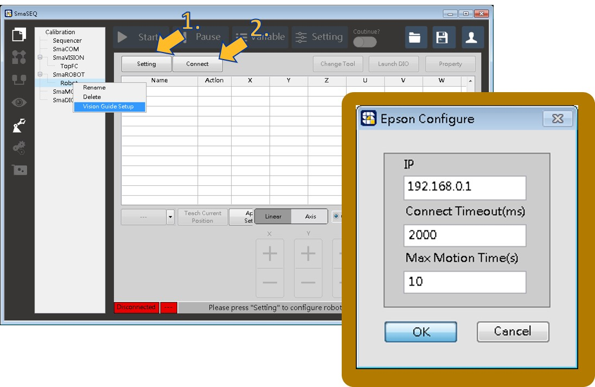
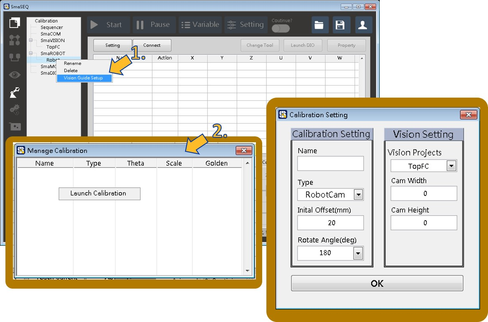
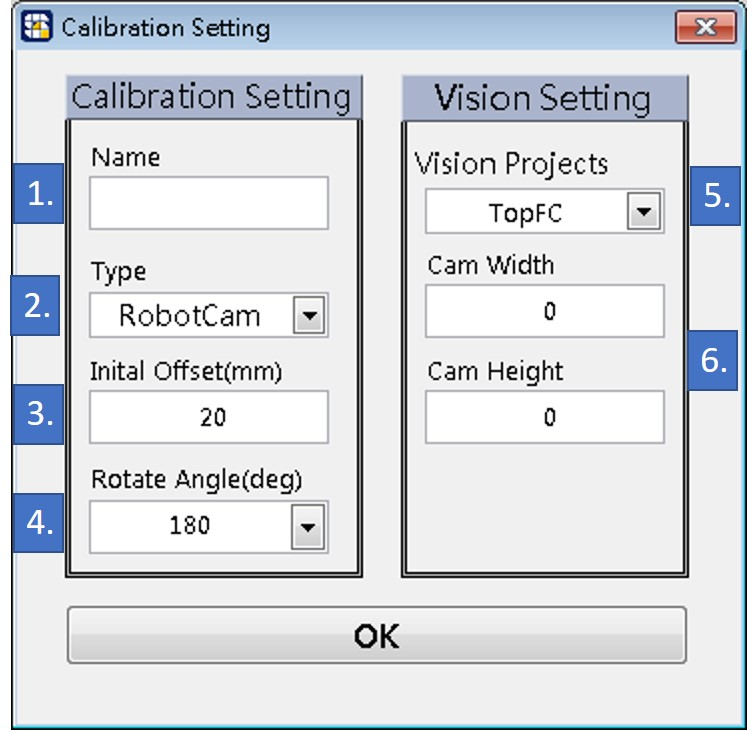
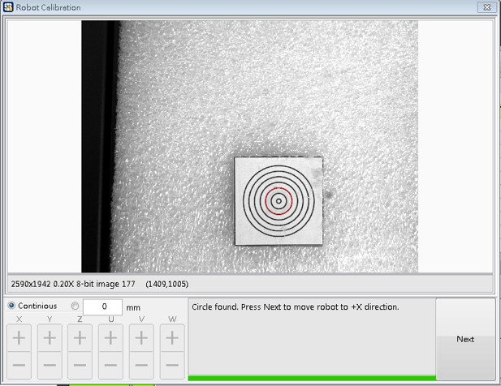
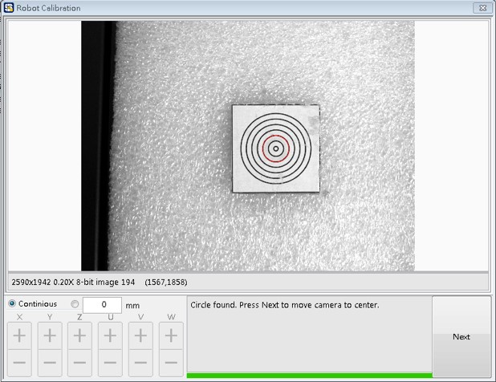
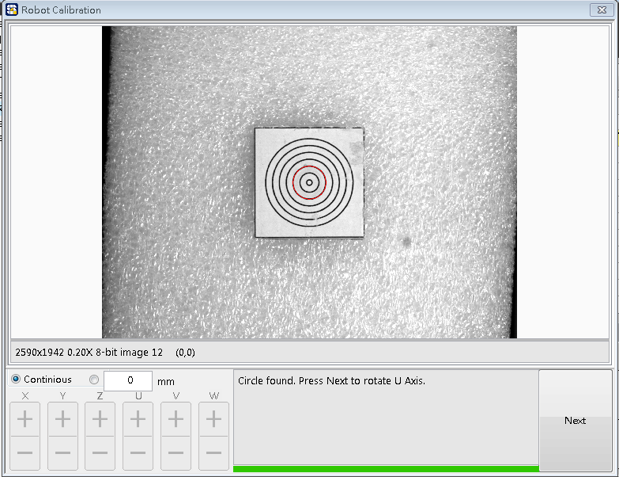
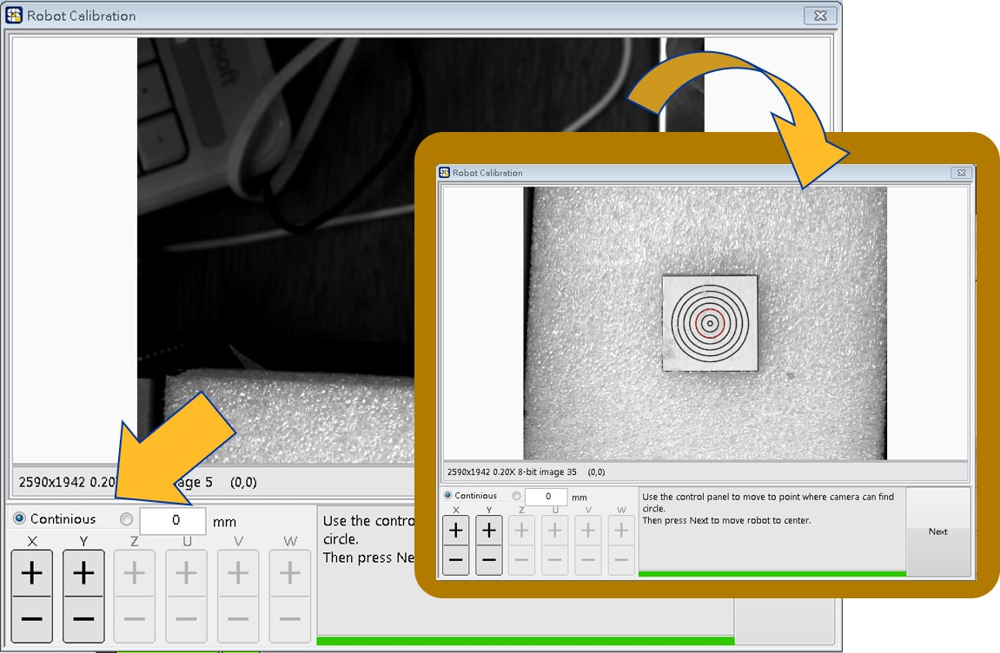
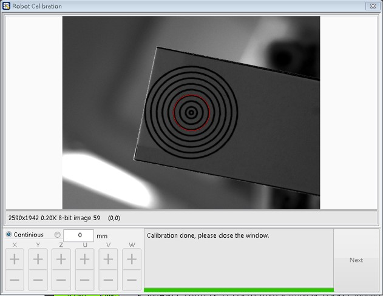
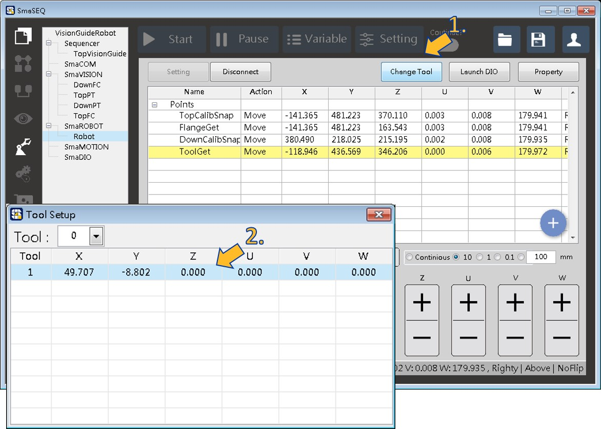

# 手臂與相機關係建立

建立相機與手臂之間的座標轉換關係：\(RobotCam & DownCam\)

* 前置準備：取得欲校正相機的解析度\(可從NI Max查看\)
* RobotCam與DownCam校正須確定手臂拍照位於U軸可以自由旋轉180度與-180度。

1. 右鍵點擊SmaRobot，選擇Create New。
2. 為本手臂模組命名。

* 設定手臂連線模組：

1. 點擊Setting設定手臂連線設定。
2. 點擊Connect連線。
3. 移動手臂至拍照位置，並記錄手臂的點位\(此點位的Z軸高度即為之後導引的取像高度\)。
4. 若校正為DownCam，拍照點的U軸角度必須為0。

* 啟動校正程序：

1. 右鍵點擊手臂模組，選擇Vision Guide Setup。
2. 跳出Manage Calibration視窗，在視窗空白處點右鍵選擇Launch Calibration。

1. Name：校正名稱。
2. Type：校正種類，分成RobotCam、TopCam與DownCam三種。
3. Initial Offset：初始校正往X方向移動的距離。
4. Rotate Angle：校正過程旋轉U軸的角度。
5. Vision Project：選擇剛建立識別校正片的SmaVision專案。
6. Cam Width/Height：相機的x / y解析度。

* 開始手臂視覺取物校正step 1：

1. 若找圓成功，畫面會將以紅色圓框標示圓位置。
2. 點擊Next，手臂會往X軸正方向移動設定的距離。

* 手臂視覺取物校正step 2：

1. 移動完畢後，畫面將標示圓點位置。
2. 點擊Next，手臂移動使圓點在畫面中心。

* 手臂視覺取物校正step 3：

1. 移動完畢後，畫面將標示圓點位置。
2. 點擊Next，手臂相機開始旋轉180度或是-180度\(請留意手臂周遭是否安全\)。

* 手臂視覺取物校正step 4：

1. 旋轉後，程式會要求使用者操作手臂，使圓點再次回到畫面中\(如畫面面板所示\)。
2. 點擊Next，找圓後移動手臂使其位在影像中心。

* 手臂視覺取物校正step 5：

1. 移動完畢後，畫面將標示圓點位置。
2. 點擊Next，手臂相機旋轉180度或-180度並回到旋轉位置。

* 手臂視覺取物校正完成：

* 手臂工具資料：若為校正DownCam，會自動新增該工具座標。

