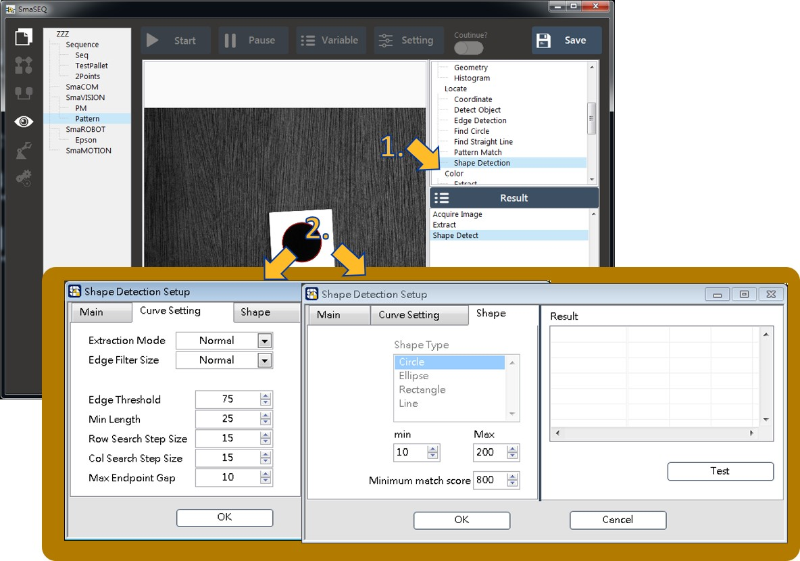
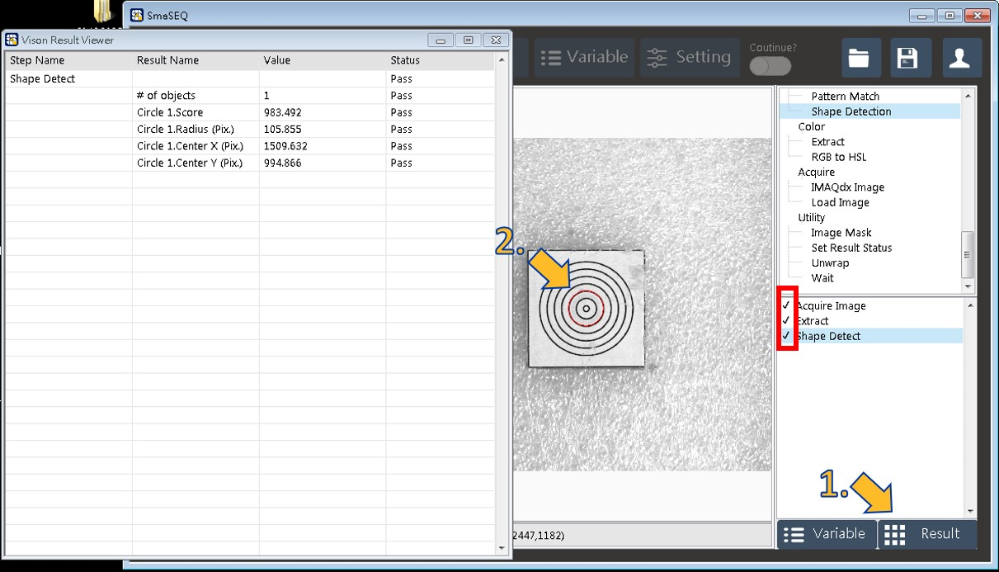

# 校正視覺專案設定

建立能辨識校正片的視覺專案\(推薦使用偲倢校正片或自行印製圓形於紙張上進行校正\)。

* 前置準備：移動手臂至拍照點\(若校正為DownCam，須將拍照點的U軸轉換成0\)。

1. 右鍵點擊SmaVision，點選Create new。
2. 為本視覺模組命名。

* 接著編輯影像模組來取得圖像：

1. 在Acquire的選項中選擇AcquireIMAXQdx來新增取像功能。
2. 在彈出視窗中選擇相機，這時會在影像視窗中看到連續影像，並選擇ok。
3. 記得點擊右上角的儲存。

* 調整焦距與光圈：

1. 在專案列表按右鍵選取剛建立的專案，選擇Launch。
2. 此時介面會連續取像並調整成適當的焦距與光圈。
3. 影像顯示視窗可點擊右鍵選取"放大工具"。

* 對圖像做灰階設定\(此步驟僅彩色相機需要\)：

1. 在Color的選項中點擊Extract進行抽色。
2. 彈出視窗中選擇色彩平面\(通常選擇Green\)。
3. 記得點擊右上角儲存。

* 設定形狀搜尋：

1. 在Locate選項中點擊Shape Detection使用找圓功能。
2. 在彈出視窗功能設定參數，並同時點擊Test測試，直到找到圓為止。\(若找不到圓時可適度調整Edge Threshold，若找到多個圓可調整半徑\)
3. 記得在右上角點選儲存。

* 測試抓取到的模組結果：

1. 點擊右下角的Result，即彈出視窗顯示測試結果。
2. 在影像視窗中會以紅色overlay顯示找到的圓。
3. 確認紅色框裡是否都有設定完成的勾字號。

