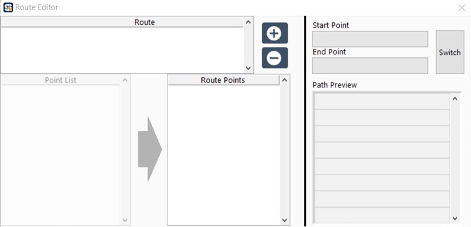

# 自動路徑規劃

使用者設定手臂運動時，常遇到當下工作環境導致需要設定更多點位避開障礙物，自動路徑規劃主要是防止手臂在移動過程中撞擊障礙物，達到避障的效果。在此SmaRobot規劃出設定幾個避障點就能達成路徑規劃的成效，以下是SmaRobot自動路徑規劃的介紹。

* 自動路徑規劃設定在SmaRobot操作介面的上方紅色框處\(在使用此之前先完成點位設定\)：

* 當手臂完成點位設定後，配合自動路徑規劃的功能將點位依照現場狀況進行劃分，並組成若干條路徑，如此一來在手臂移動時可避免在使用者在不了解情況之下導致撞機的風險，同時也能將流程更加簡化。

* 點擊"Edit Route"後會出現以下視窗：

