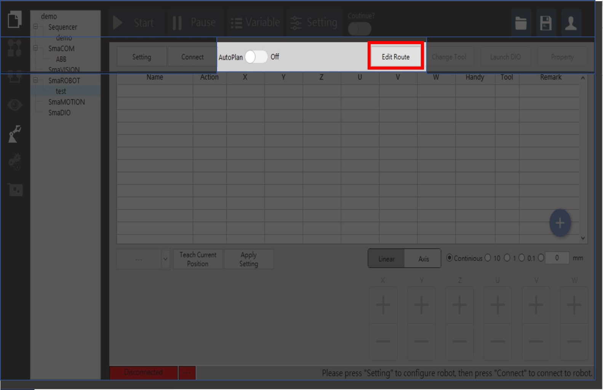
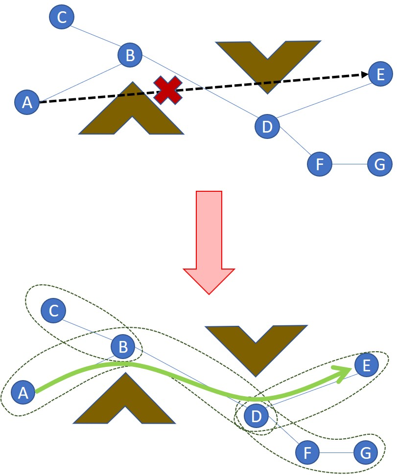
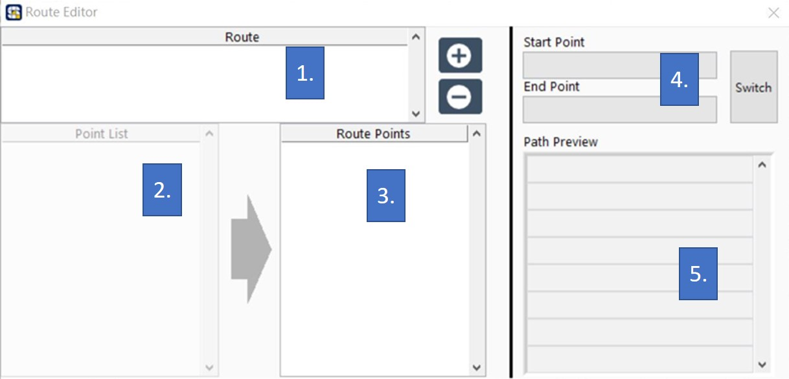
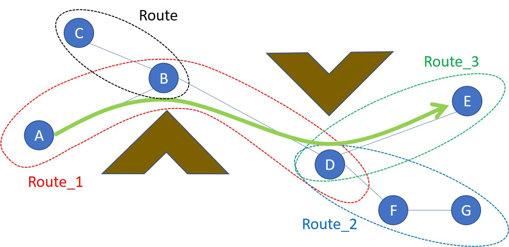
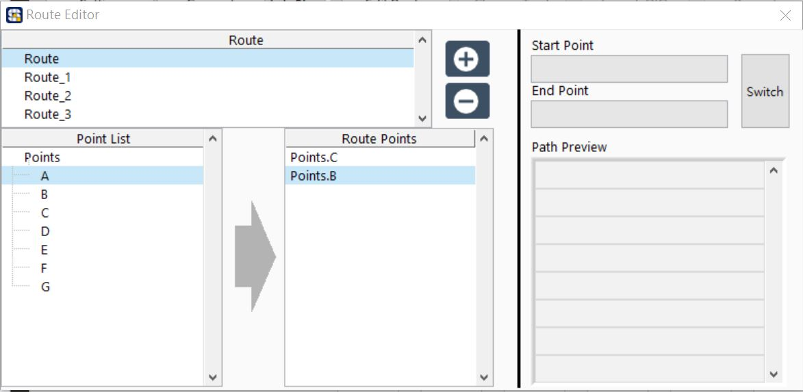
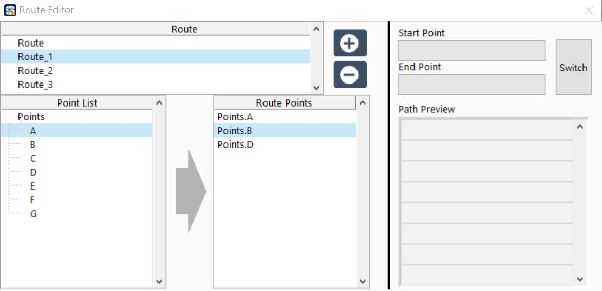
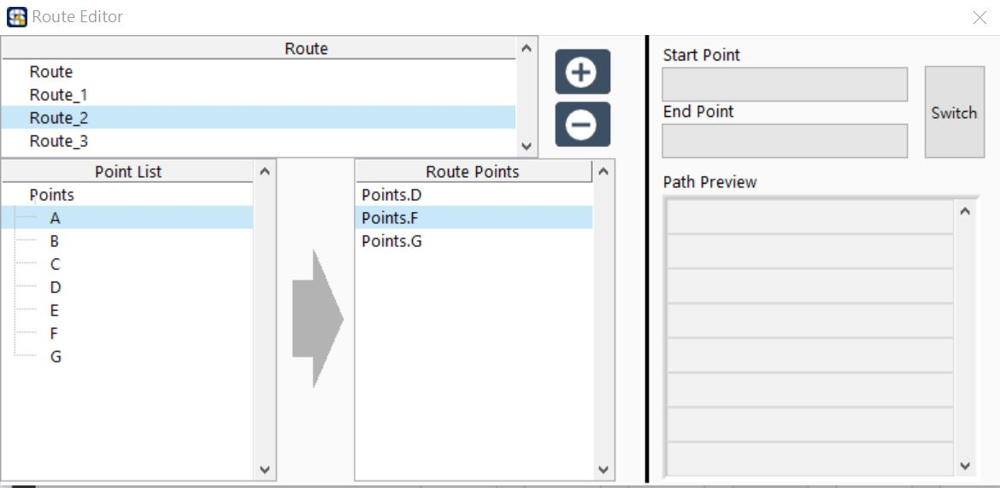
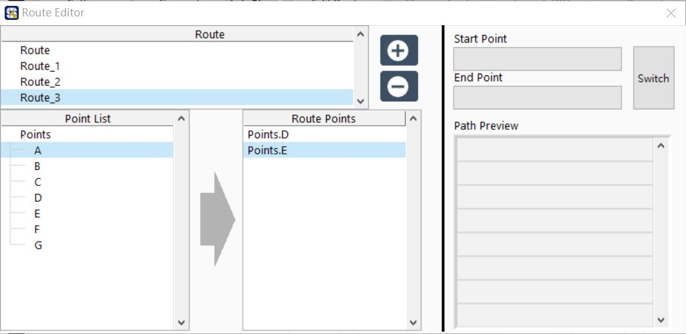
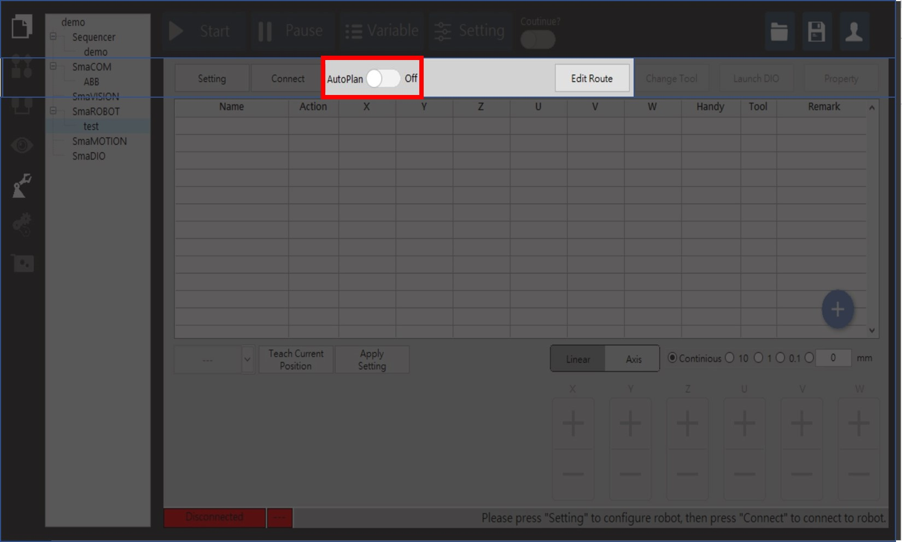
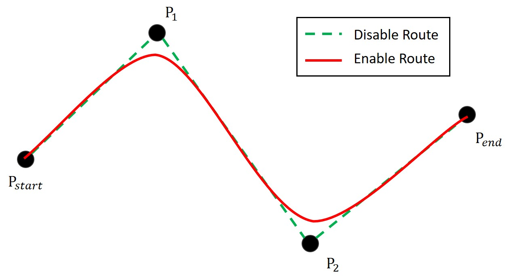

# 自動路徑規劃

使用者設定手臂運動時，常遇到當下工作環境導致需要設定更多點位避開障礙物，自動路徑規劃主要是防止手臂在移動過程中撞擊障礙物，已達到避障的效果。在此SmaRobot規劃出只要設定幾個避障點就能達成路徑規劃的成效，以下是SmaRobot自動路徑規劃的介紹。

* 自動路徑規劃設定在SmaRobot操作介面的上方紅色框處\(在使用此之前先完成手臂點位設定\)：

* 當手臂完成點位設定後，配合自動路徑規劃的功能將點位依照現場狀況進行劃分，並組成若干條路徑，如此一來在手臂移動時可避免在使用者在不了解情況之下導致撞機的風險，同時也能將流程更加簡化。

* 點擊"Edit Route"後會出現以下視窗：

1. **路徑組別表**：將定義好的途經點\(via\)儲存為組別並顯示在表格\(若需要 新增/刪除 路徑組別，分別在中間圖 加號/減號 設定\)。
2. **路徑點位表**：使用者設定的點位都會在此顯示。
3. **途經點位表**：顯示使用者自行選擇之路徑組別中的途經點位。
4. **路徑 起始點/終點 表**：顯示起始點/終點位置\(switch功能是轉換起始/終點位置\)。
5. **途經點預覽設定表**：預覽顯示該路徑組別之途經點順序。

* 依照自動路徑規劃藍圖設定路徑組別：

* 設定完成後記得開啟"AutoPlan"功能，兩點之間的運動將會自動規畫路徑並使用Route方式移動至目標點：

* 若設定成功，手臂運動路徑每經過途經點會快速且圓滑的方式運動。

